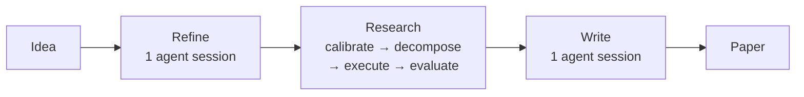
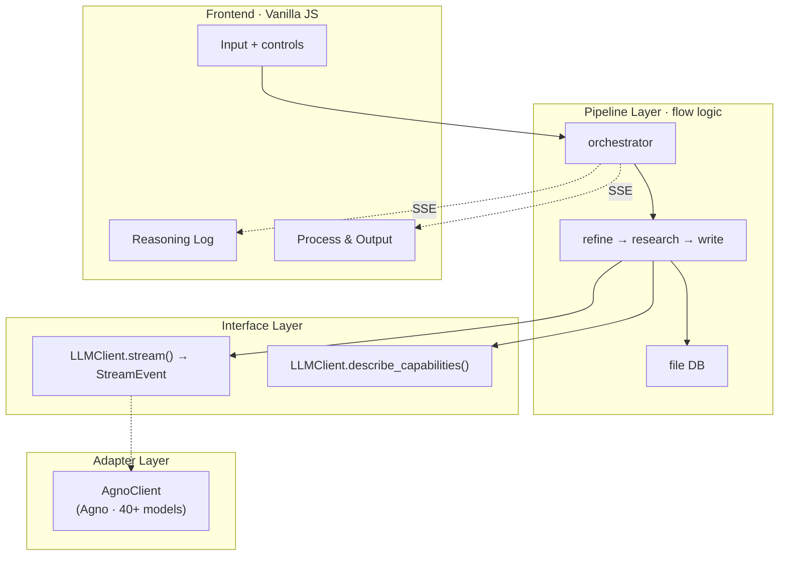

# MAARS

[中文](README_CN.md) | English

**Multi-Agent Automated Research System** — From one idea to a full research paper, fully automated.

## Pipeline

Three stages, powered by Agno agent framework with multi-provider support (Google, Anthropic, OpenAI).



| Stage | What it does |
|-------|-------------|
| **Refine** | Agent autonomously explores literature, evaluates directions, and crystallizes a structured research proposal |
| **Research** | Calibrate capability → recursive decompose → parallel execute with verify (pass / retry / redecompose) → evaluate. Iterates until satisfied |
| **Write** | Agent reads all task outputs via tools, designs paper structure, and writes the complete paper in one session |

## Configuration

```env
# .env
MAARS_GOOGLE_API_KEY=your-key

# Model provider: google (default), anthropic, or openai
# MAARS_AGNO_MODEL_PROVIDER=google
# MAARS_AGNO_MODEL_ID=claude-sonnet-4-5
# MAARS_ANTHROPIC_API_KEY=your-key
```

## Architecture

Three-layer decoupling — pipeline depends on an interface, adapter implements it:



See [docs/EN/architecture.md](docs/EN/architecture.md) for detailed data flow and design principles.

## Quick start

```bash
git clone https://github.com/dozybot001/MAARS.git && cd MAARS
python3 -m venv .venv && source .venv/bin/activate
pip install -r requirements.txt
cp .env.example .env  # add your API key
uvicorn backend.main:app --host 0.0.0.0 --port 8000
# Open http://localhost:8000
```

## Output

Each run creates a timestamped folder:

```
results/{timestamp}-{slug}/
├── idea.md           # Input
├── refined_idea.md   # Refine output
├── plan.json         # Flat atomic task list
├── plan_tree.json    # Decomposition tree
├── tasks/            # Individual task outputs
├── artifacts/        # Code scripts + experiment outputs
├── evaluations/      # Iteration evaluations (if multi-iteration)
├── paper.md          # Final paper
├── Dockerfile.experiment  # Auto-generated Docker reproduction
├── run.sh            # Experiment runner script
└── docker-compose.yml
```

## Documentation

| Doc | Content |
|-----|---------|
| [Architecture (EN)](docs/EN/architecture.md) | Three-layer design, data flow |
| [Architecture (CN)](docs/CN/architecture.md) | 同上，中文版 |
| [Research Workflow (CN)](docs/CN/research-workflow.md) | Calibrate → Decompose → Execute → Verify → Redecompose → Evaluate |
| [Prompt Engineering (CN)](docs/CN/prompt-engineering.md) | All prompts, modification guide |
| [Code Smells (CN)](docs/CN/code-smells.md) | Known issues and fix priorities |
| [Multi-Agent Design (CN)](docs/CN/multi-agent-design.md) | Future: 3-agent architecture (Orchestrator + Scholar + Critic) |

## Community

[Contributing](.github/CONTRIBUTING.md) · [Code of Conduct](.github/CODE_OF_CONDUCT.md) · [Security](.github/SECURITY.md)

## License

MIT
