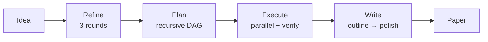
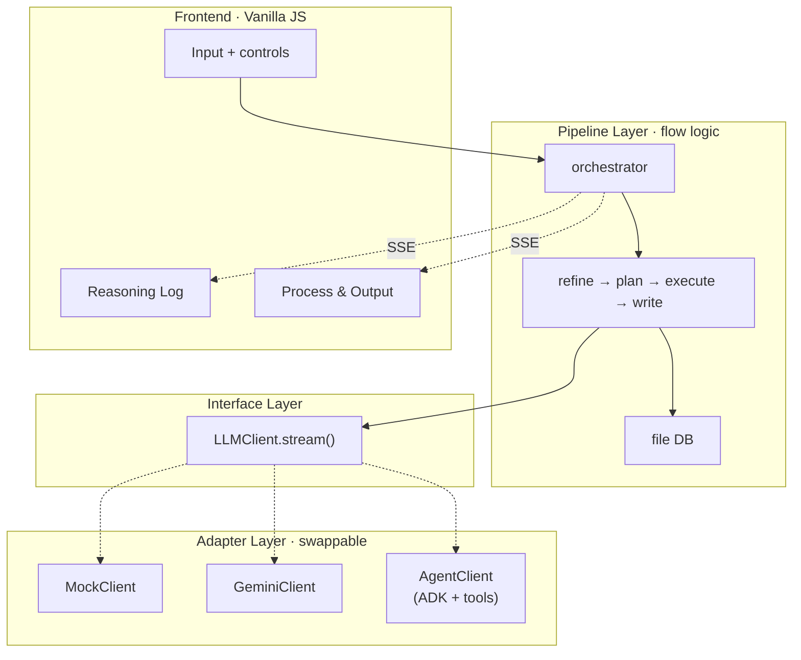

# MAARS

[中文](README_CN.md) | English

**Multi-Agent Automated Research System** — From one idea to a full research paper, fully automated.

## Pipeline

Four fixed stages. Every mode runs the same pipeline — modes only swap the engine underneath.



| Stage | What it does |
|-------|-------------|
| **Refine** | Explore → Evaluate → Crystallize. Turns a vague idea into a structured research proposal |
| **Plan** | Recursive decomposition into atomic tasks with dependency DAG (depth 3, batch-parallel) |
| **Execute** | Topological sort → parallel batch execution → verification → retry. Results stored in file DB |
| **Write** | Outline → section-by-section writing → polish. Each section receives only its relevant task outputs |

## Modes

`.env` one-line switch:

```env
MAARS_LLM_MODE=mock      # or gemini, or agent
MAARS_GOOGLE_API_KEY=your-key
```

Modes replace the engine at each stage, not the pipeline logic:

| Stage | Mock | Gemini | Agent |
|-------|------|--------|-------|
| **Refine** | replay | GeminiClient | AgentClient + search tools |
| **Plan** | replay | GeminiClient | AgentClient (no tools) |
| **Execute** | replay | GeminiClient | AgentClient + search + code + DB tools |
| **Write** | replay | GeminiClient | AgentClient + search + DB tools |

> All three modes use the same pipeline stages. Only the `LLMClient` implementation differs.

## Architecture

Three-layer decoupling — pipeline depends on an interface, adapters implement it:



| Principle | Detail |
|-----------|--------|
| Three-layer decoupling | `pipeline/` → `LLMClient` → `mock/gemini/agent` — pipeline never knows which adapter is active |
| DB-only inter-stage communication | Stages read input from DB, write output to DB. No string passing between stages |
| Read/write split | **Read**: Agent uses tools autonomously; Gemini/Mock pre-loaded by pipeline. **Write**: always deterministic via `finalize()` |
| Broadcast split | `has_broadcast=False` (Gemini/Mock): pipeline emits chunks. `has_broadcast=True` (Agent): adapter broadcasts Think/Tool/Result |

## Quick start

```bash
git clone https://github.com/dozybot001/MAARS.git && cd MAARS
python3 -m venv .venv && source .venv/bin/activate
pip install -r requirements.txt
cp .env.example .env  # add your API key
uvicorn backend.main:app --host 0.0.0.0 --port 8000
# Open http://localhost:8000
```

## Data Flow

### Gemini Mode

Pipeline pre-loads content into prompts. GeminiClient streams text.

```
Idea → Refine (3 rounds, DB pre-loaded)
     → Plan (recursive decompose, DB pre-loaded)
     → Execute (batch parallel, deps pre-loaded into prompt)
     → Write (outline → sections → polish, reads DB directly)
     → Paper
```

### Agent Mode

Agent reads inputs via tools autonomously. Pipeline only provides directives.

```
Idea → Refine (Agent searches arXiv, reads papers)
     → Plan (AgentClient no tools, structured JSON)
     → Execute (Agent reads deps via read_task_output,
                runs code via code_execute → Docker artifacts)
     → Write (Agent reads all tasks/plan/idea via tools,
              searches for citations)
     → Paper + artifacts/
```

| | Gemini | Agent |
|---|---|---|
| Read input | Pipeline pre-loads from DB | Agent reads via tools |
| Write output | `finalize()` writes DB | Same (deterministic) |
| Dependencies | Content in prompt | Agent calls `read_task_output` |
| Tools | None | search, code, DB, fetch |
| UI broadcast | Pipeline emits chunks | AgentClient broadcasts |
| Artifacts | None | `artifacts/` (Docker) |

## Output

Each run creates a timestamped folder:

```
research/{timestamp}-{slug}/
├── idea.md           # Input
├── refined_idea.md   # Refine output
├── plan.json         # Flat atomic task list
├── plan_tree.json    # Decomposition tree
├── tasks/            # Individual task outputs
├── artifacts/        # Code scripts + experiment outputs (Agent mode)
├── paper.md          # Final paper
└── reasoning.log     # Full execution log
```

## Showcase

| Run | Mode | Topic | Tasks |
|-----|------|-------|-------|
| `20260323-210300-*` | Gemini | Cognitive Buffer Hypothesis — cultural modulation of news framing | 31 |
| `20260323-223406-*` | Agent | HMAO — adversarial multi-agent role specialization | 12 |

Build history: [Intent showcase/maars](https://github.com/dozybot001/Intent/tree/main/showcase/maars)

## Community

[Contributing](.github/CONTRIBUTING.md) · [Code of Conduct](.github/CODE_OF_CONDUCT.md) · [Security](.github/SECURITY.md)

## License

MIT
