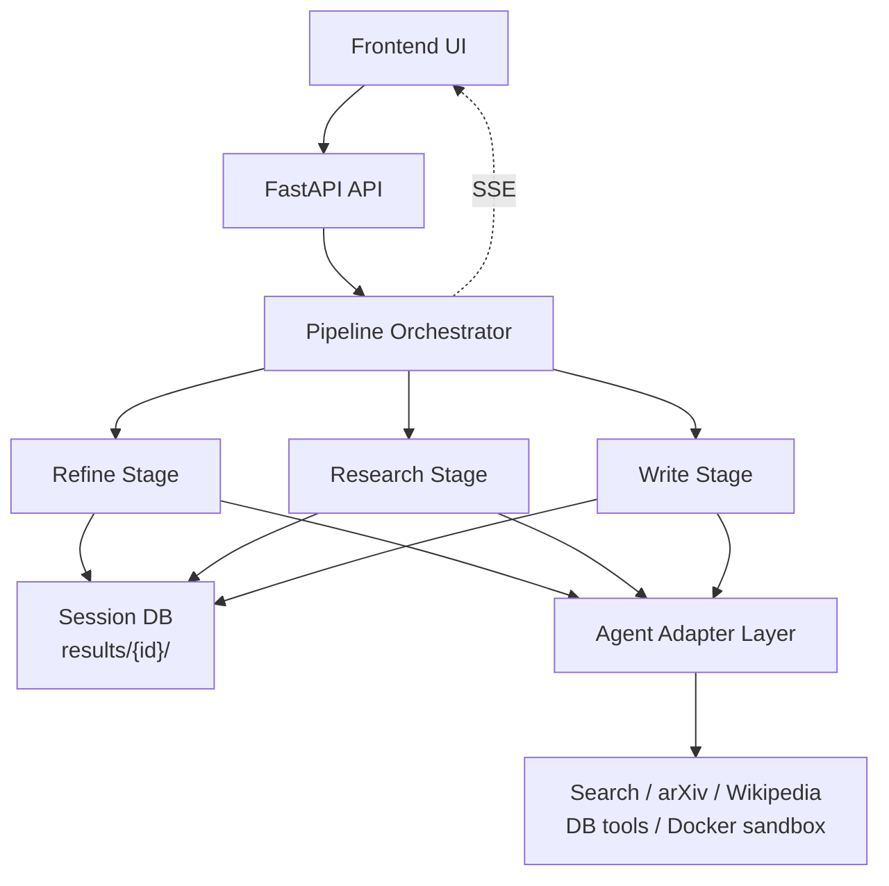
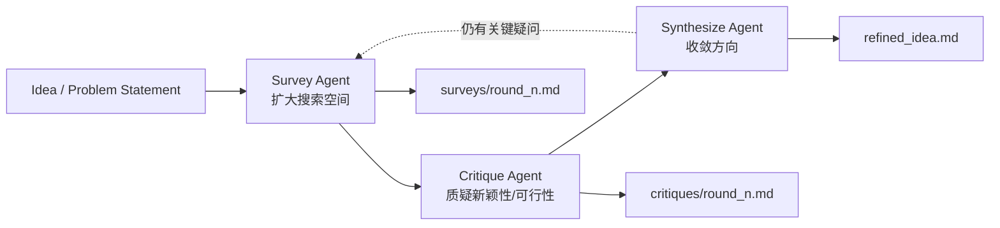
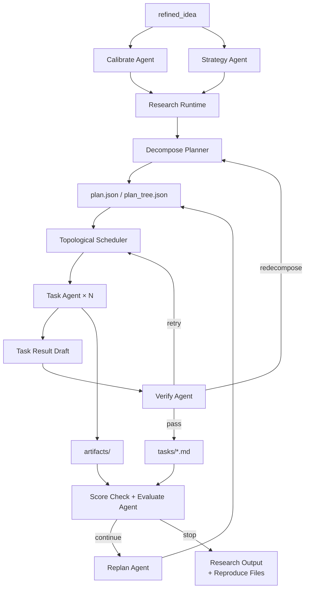
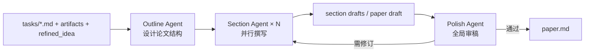

# MAARS 架构设计

> 本文是 MAARS 的架构设计文档，不是代码导读。
> 它回答的是“系统为什么这样设计、核心边界在哪里、未来如何演进”，而不是逐文件解释实现。
> 当前实现映射放在文末，作为设计落地情况说明。

## 1. 设计目标

MAARS 要解决的问题不是“让一个模型写一篇长文”，而是把一项研究工作拆成可控、可恢复、可审计的系统流程。

系统设计目标有四个：

1. **端到端自动化**：从研究想法或 Kaggle 比赛入口出发，最终产出结构化研究结果和论文。
2. **控制权外化**：把阶段切换、依赖调度、重试、迭代停止等确定性逻辑交给系统，而不是交给模型临场决定。
3. **智能能力内聚**：把搜索、分析、代码执行、写作等开放性工作交给 agent 完成，让模型在自己最擅长的地方发挥价值。
4. **结果可恢复、可复盘**：所有重要状态和产出落盘，前端能看到执行过程，失败后能恢复，结束后能追溯。

对应地，MAARS 明确不追求两件事：

- 不追求“一个全局超级 agent 自主完成一切”。
- 不追求“从第一天就是完整多智能体协作系统”。

## 2. 核心设计判断

MAARS 的架构建立在一个核心判断上：

**把不确定性留给 agent，把确定性留给 runtime。**

更具体地说：

- 如果一个决策可以稳定地写成 `if / for / while`，就应该由系统 runtime 负责。
- 如果一个任务依赖检索、比较、写代码、解释结果、组织文本，就应该交给 agent。

这直接导出了 MAARS 的整体形态：

- 顶层是三阶段流程编排。
- 中层是 Research 阶段的 workflow runtime。
- 底层是一个个独立的 agent run。

这也是为什么 MAARS 当前最准确的定义不是 “pure multi-agent system”，而是：

**一个以 agent 为执行引擎、以 runtime 为控制中枢的自动化研究系统。**

如果未来 Refine 和 Write 完成 multi-agent 化，而 Research 仍保持 workflow 核心，那么 MAARS 在系统层面可以被准确描述为：

**一个 hybrid multi-agent research system。**

这里的关键不是“所有部分都必须是 multi-agent”，而是：

- 系统整体已经包含实质性的多 agent 协作模块
- 但执行主干仍由 workflow runtime 托底
- multi-agent 扩展长在 workflow 骨架之上，而不是替代骨架

### 2.1 与 Harness Engineering 的关系

如果借用 OpenAI 在 2026 年提出的 `harness engineering` 视角，MAARS 的 `Research` 可以被理解为一种 **research-task 级别的 harness engineering**。

这里的重点不是“换了一个新名词”，而是我们确实在做同一类工作：

- 设计 agent 的执行环境
- 外化状态和约束
- 建立工具边界
- 建立验证与反馈回路
- 让 agent 在一个可控 harness 里稳定完成任务

但 MAARS 当前做的不是 repo-scale 的 harness engineering，也不是“无人工写码的 agent 软件工厂”。
它更准确地说，是把 harness engineering 的思想落在**研究任务执行**这一层：

- session DB 是 system of record
- Docker sandbox 是执行环境
- verify / evaluate / replan 是反馈回路
- runtime 负责控制，agent 负责执行

因此，把 harness engineering 写进 MAARS 文档是准确的，但应该保持这个限定：

**MAARS 做的是面向 research workflow 的 harness engineering，而不是面向整个软件仓库生命周期的 harness engineering。**

## 3. 总体架构



这个架构分成五个设计层次：

1. **入口层**：前端 + FastAPI，用于启动、暂停、恢复和观察执行过程。
2. **编排层**：负责三阶段顺序和生命周期控制。
3. **阶段层**：每个 stage 是一个稳定边界，输入输出通过 session DB 连接。
4. **智能执行层**：agent 负责搜索、分析、实验和写作。
5. **工具与状态层**：工具负责和外部世界交互，文件型 DB 负责保存系统状态。

## 4. 三阶段设计

MAARS 把研究过程拆成三个阶段，不是因为“论文流程天然就有三步”，而是因为这三个阶段面对的是三类不同问题。

### 4.1 Refine：研究问题形成

Refine 负责把输入意图转化为可执行的研究目标。

它的设计职责是：

- 明确研究问题
- 收敛研究方向
- 补齐背景、假设、方法大纲和目标
- 产出可交给 Research 阶段分解的 `refined_idea`

从设计上看，Refine 本质上更接近一个**探索与收敛问题**。
这类问题天然适合多视角交叉验证，因此 Refine 的目标架构是 multi-agent。

但在当前阶段，MAARS 把它实现为单 session agent，原因是：

- Kaggle 模式通常可以直接跳过 Refine
- 系统当前最大的价值集中在 Research runtime
- Refine 的多角色设计重要，但不是现阶段最高优先级

#### Refine 内部架构（目标形态）



这个阶段内部的关键不是“多跑几个模型”，而是显式保留三个角色：

- `Survey`：负责发散，建立候选方向集。
- `Critique`：负责收紧约束，防止草率收敛。
- `Synthesize`：负责把调研和批评压缩成单一、可执行的问题定义。

### 4.2 Research：执行型工作流核心

Research 是 MAARS 的核心。

它负责把一个研究目标转化为一组可执行任务，并在运行中持续判断：

- 任务是否拆得合理
- 结果是否足够
- 是否需要重试
- 是否需要重新分解
- 是否需要下一轮改进

Research 不是简单 pipeline，也不是多智能体协作。
它的设计定位是：

**一个带反馈回路、DAG 调度、运行时重规划能力的 agentic workflow runtime。**

这是当前 MAARS 最重要、也最应该保持稳定的架构核心。

#### Research 内部架构



这个阶段内部可以分成两类部件：

- **runtime 部件**：plan 管理、批次调度、状态持久化、停止条件、错误恢复。
- **agent 部件**：calibrate、strategy、planner、worker、verifier、evaluator、replanner。

也正因为如此，Research 的骨架必须是 workflow：

- worker 可以替换
- planner 可以增强
- verify/evaluate 可以升级

但只要 runtime 还在，系统的 DAG、checkpoint、artifact 和 stop rule 就仍然可控。

### 4.3 Write：结果综合与论文生产

Write 负责把 Research 阶段生成的任务结果、图表、实验输出和背景上下文，综合成一篇完整论文。

它的设计职责是：

- 读取所有研究结果
- 形成论文结构
- 整合实验、图表和引用
- 输出完整 paper

从问题性质上看，Write 不是简单拼接，而是一个**全局一致性与叙事组织问题**。
因此从设计目标上，Write 也应该演进到 multi-agent 结构，例如：

- 规划
- 分章撰写
- 全局润色/审稿

但和 Refine 一样，当前实现先采用单 session agent 落地。

#### Write 内部架构（目标形态）



Write 适合 multi-agent，不是因为它需要更多 token，而是因为它天然包含三种不同角色：

- `Outline`：决定章节结构和证据组织方式。
- `Section`：把任务产出和图表转换为局部章节文本。
- `Polish`：从全局一致性、重叠、遗漏和叙事闭环角度回看整篇论文。

## 5. 跨阶段支撑设计

有三类横切设计，支撑整个系统成立：

### 5.1 状态外化

MAARS 把状态中心设计成 `results/{session_id}/` 下的一组文件，而不是隐藏在 agent 上下文里。

它的意义只有一句话：

**阶段之间通过文件契约衔接，而不是通过内存耦合。**

一个稳定的 session 至少需要承载：

```text
results/{id}/
├── idea.md
├── refined_idea.md
├── plan.json
├── plan_tree.json
├── tasks/
├── artifacts/
├── evaluations/
└── paper.md
```

### 5.2 工具边界

MAARS 把 agent 当成带工具的执行单元，因此工具边界必须清晰：

- **检索工具**：负责搜索、查论文、补背景。
- **DB 工具**：负责读取任务、计划和已有结果。
- **Docker 工具**：负责真实代码执行和 artifact 生成。

其中最重要的设计原则是：

**让 agent 按需取上下文，而不是让 orchestrator 预先拼一个巨大的 prompt。**

### 5.3 可观测性

系统交互被拆成两层：

- **控制面**：`start / stop / resume / status`
- **观测面**：SSE 持续推送 stage、phase、task 和日志事件

这意味着前端不是调度者，而是 runtime 的观察器。

这三类横切设计合在一起，也正是 MAARS 里最接近 harness engineering 的部分：

- 状态外化
- 工具可达
- 反馈可观测

## 6. 演进策略

MAARS 的演进方向不是“把 workflow 替换成大 agent”，而是：

- 保持 `Research` 的 workflow 骨架稳定
- 优先把 `Refine` 和 `Write` 演进为 multi-agent
- 在 workflow 骨架之上增加更强的多角色策略能力

因此最终更准确的命名是：

**以 workflow 为骨架、以 multi-agent 为增强层的 hybrid multi-agent research system。**

## 7. 当前实现映射

当前代码已经落地的核心是：

- 顶层 `refine -> research -> write` 三阶段编排
- 文件型 session DB
- Agno adapter 层
- 检索、DB、Docker 三类工具
- Research runtime
- SSE 驱动的前端观测

当前仍然是简化落地的部分：

- Refine：单 session agent
- Write：单 session agent

尚未落地的目标形态：

- Refine multi-agent
- Write multi-agent
- 持久 scholar / critic / orchestrator agent

## 8. 最终口径

**MAARS 当前是一个三阶段自动化研究系统，其中 Refine 和 Write 暂为单 agent stage，Research 是 runtime 驱动的 agentic workflow；系统未来会演进为以 workflow 为骨架、以 multi-agent 为增强层的 hybrid multi-agent research system。**
