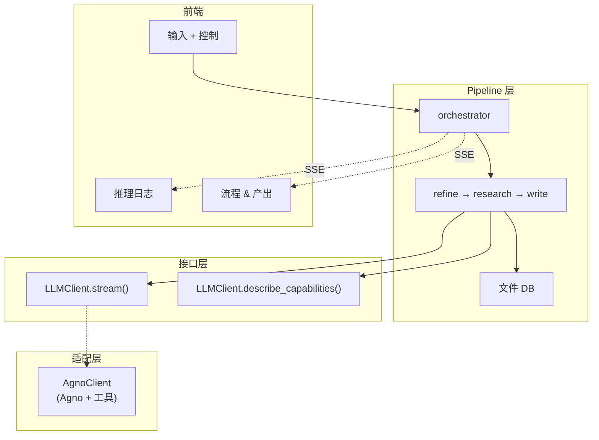

# 架构与数据流

## 三层架构

```
Pipeline 层（流程逻辑）
    ↓ 依赖
Interface 层（LLMClient.stream()）
    ↓ 实现
Adapter 层（AgnoClient）
```

Pipeline 定义通用流程，Adapter 负责 LLM 通信。



## 设计原则

| 原则 | 说明 |
|------|------|
| **三层解耦** | `pipeline/` → `LLMClient` → `agno/` — pipeline 不知道当前是哪个适配器 |
| **阶段间仅通过 DB 通信** | 每个阶段从 DB 读输入，写产出到 DB，不通过内存传递 |
| **工具驱动的依赖读取** | Agent 通过工具（`read_task_output`）自主读取依赖；pipeline 仅列出 ID |
| **统一广播** | 所有 Client yield `StreamEvent`，pipeline 通过 `_dispatch_stream()` 统一广播 |
| **动态能力校准** | 原子任务定义不再硬编码——每次运行前由 Agent 自评能力边界 |
| **工具策略** | Agno 内置（DuckDuckGo、arXiv、Wikipedia）+ 自建（DB、Docker） |

## 三阶段 Pipeline

```
Refine → Research → Write
```

| 阶段 | 职责 | 类 |
|------|------|-----|
| **Refine** | 将模糊想法精炼为完整研究提案 | `AgentRefineStage` |
| **Research** | 校准→分解→执行→验证→评估 循环 | `ResearchStage` |
| **Write** | 将研究产出综合为完整论文 | `AgentWriteStage` |

Research 阶段内部支持：
- 能力校准（Calibrate）
- 递归任务分解（Decompose）
- 拓扑排序并行执行（Execute）
- 三路验证：通过 / 重试 / 重新分解（Verify）
- 结果评估与迭代（Evaluate）

## 数据流

Agent 通过工具自主读取输入。Refine 和 Write 使用独立的 Agent stage（单 session），
Research 复用 pipeline stage（Agent 作为 LLM client）。

```
用户输入 idea
  ↓
REFINE ← AgentRefineStage（单 session）
  ├── AgnoClient.stream()：
  │   ├── Agent 自主执行 Explore → Evaluate → Crystallize
  │   ├── 使用搜索工具查找真实文献
  │   └── Think/Tool/Result → broadcast → UI
  └── finalize() → db.save_refined_idea()

RESEARCH ← ResearchStage（Agent 作为 LLM client）
  ├── Phase 0: Calibrate（一次完整 Agent session）
  │   ├── Agent 知道自己有什么工具（describe_capabilities()）
  │   ├── 可试用工具探测实际可用性
  │   └── 输出：针对当前研究主题的原子任务定义
  ├── Phase 1: Decompose（使用 calibrated 定义）
  │   └── 递归分解 → LLM 判断 atomic/decompose → plan.json
  ├── Phase 2: Execute + Verify
  │   ├── 每个任务 → 独立 Agent session：
  │   │   ├── prompt 列出依赖 ID，Agent 用 read_task_output 工具读取
  │   │   ├── Agent 自主决策：search / code_execute / fetch
  │   │   │   └── code_execute → Docker 容器 → artifacts/ 落盘
  │   │   └── verify → pass / retry / redecompose
  │   └── 重新分解的子任务继承父任务 partial output 作为 context
  └── _build_final_output() + generate_reproduce_files()

WRITE ← AgentWriteStage（单 session）
  ├── AgnoClient.stream()：
  │   ├── Agent 调用 list_tasks → read_task_output → read_refined_idea
  │   ├── Agent 自主决定论文结构并撰写
  │   └── 完整论文 → yield → pipeline
  └── finalize() → db.save_paper()
```

## 阶段间通信

阶段之间**仅通过 DB** 通信。

```
results/{timestamp-slug}/
├── idea.md              Refine 读取
├── refined_idea.md      Research 读取    ← Refine 写入
├── plan.json            Research 内部    ← Research.decompose 写入
├── plan_tree.json       前端/Write       ← Research.decompose 写入
├── tasks/*.md           Write 读取      ← Research.execute 写入
├── artifacts/           Write 引用      ← Docker 写入
├── evaluations/*.json   Research 内部    ← Research.evaluate 写入
└── paper.md                            ← Write 写入
```

## 阶段控制：Stop / Resume / Retry

| 操作 | 行为 |
|------|------|
| **Stop** | 取消 asyncio task，状态 → PAUSED。Agent ReAct loop 被 break |
| **Resume** | 重启 `run()`。Research 从 DB checkpoint 恢复（`tasks/*.md` 存在 = 已完成），跳过已完成任务。其他 stage 等同于 retry |
| **Retry** | 清空状态 + DB 文件，完全从头重跑。同时重置所有下游 stage |

```
Stop:
  orchestrator.stop_stage()
    → llm_client.request_stop()
    → stage._run_id += 1    // stale check 失效
    → cancel_task()          // CancelledError 传播
    → state = PAUSED

Resume（Research）:
  orchestrator.resume_stage()
    → stage.run()
      → _load_checkpoint()   // DB 读取已完成 task
      → 跳过 _task_results 中已有的 task
      → 执行剩余 task
```

## 文件结构

```
backend/
├── main.py                          # FastAPI 入口
├── config.py                        # 配置（环境变量）
├── db.py                            # ResearchDB：文件存储
├── utils.py                         # JSON 解析工具
├── reproduce.py                     # Docker 复现文件生成
│
├── pipeline/                        # 流程层
│   ├── stage.py                     # BaseStage 基类
│   ├── research.py                  # ResearchStage（含 calibrate/decompose/execute/evaluate）
│   ├── decompose.py                 # 递归任务分解
│   ├── evaluate.py                  # 结果评估
│   └── orchestrator.py              # 编排器：阶段调度 + SSE 广播
│
├── llm/                             # 接口层
│   ├── client.py                    # LLMClient 抽象基类 + StreamEvent
│   └── agno_client.py               # Agno Agent → StreamEvent
│
└── agno/                            # Agno 适配层
    ├── __init__.py                  # create_agno_stages()
    ├── models.py                    # 多 provider 模型创建
    ├── instructions.py              # 各阶段 Agent 指令
    ├── stages.py                    # AgentRefineStage, AgentWriteStage
    └── tools/                       # DB 工具、Docker 工具
```

## 工具策略

```
Agno 内置：DuckDuckGo、arXiv、Wikipedia
自建：DB 工具（read_task_output、list_tasks 等）、Docker sandbox（code_execute）
代码执行统一走 Docker sandbox（隔离容器，限制资源）
```

不设 Skill 层 — 模型原生 ReAct 推理替代显式编排。
