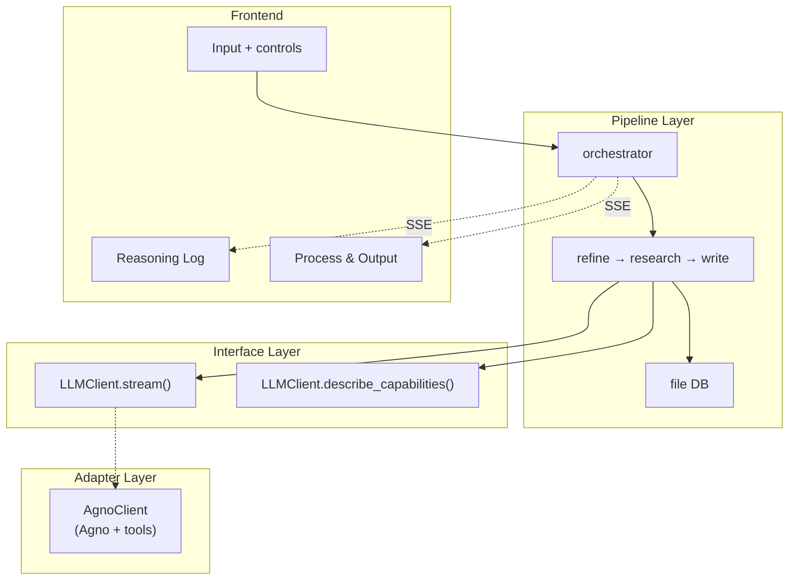

# Architecture & Data Flow

## Three-Layer Architecture

```
Pipeline Layer (flow logic)
    ↓ depends on
Interface Layer (LLMClient.stream())
    ↓ implemented by
Adapter Layer (AgnoClient)
```

Pipeline defines universal flow. The adapter handles LLM communication.



## Design Principles

| Principle | Detail |
|-----------|--------|
| **Three-layer decoupling** | `pipeline/` → `LLMClient` → `agno/` — pipeline never knows which adapter is active |
| **DB-only inter-stage communication** | Stages read input from DB, write output to DB. No in-memory passing |
| **Tool-based dependency reading** | Agent reads dependencies via tools (`read_task_output`); pipeline lists IDs only |
| **Unified broadcast** | All clients yield `StreamEvent`, pipeline dispatches via `_dispatch_stream()` |
| **Dynamic capability calibration** | Atomic task definition is calibrated by Agent before each run |
| **Tool strategy** | Agno built-in (DuckDuckGo, arXiv, Wikipedia) + custom (DB, Docker) |

## Three-Stage Pipeline

```
Refine → Research → Write
```

| Stage | Responsibility | Class |
|-------|---------------|-------|
| **Refine** | Refine vague idea into actionable research proposal | `AgentRefineStage` |
| **Research** | Calibrate → Decompose → Execute → Verify → Evaluate loop | `ResearchStage` |
| **Write** | Synthesize research outputs into complete paper | `AgentWriteStage` |

The Research stage supports:
- Capability calibration (Calibrate)
- Recursive task decomposition (Decompose)
- Topological parallel execution (Execute)
- Three-way verification: pass / retry / redecompose (Verify)
- Result evaluation and iteration (Evaluate)

## Data Flow

Agent reads inputs via tools autonomously. Refine and Write use dedicated Agent stages
(single session). Research reuses the shared pipeline stage (Agent as LLM client).

```
User idea
  ↓
REFINE ← AgentRefineStage (single session)
  ├── AgnoClient.stream():
  │   ├── Agent autonomously: Explore → Evaluate → Crystallize
  │   ├── Uses search tools for real literature
  │   └── Think/Tool/Result → broadcast → UI
  └── finalize() → db.save_refined_idea()

RESEARCH ← ResearchStage (Agent as LLM client)
  ├── Phase 0: Calibrate (full Agent session)
  │   ├── Agent knows its tools (describe_capabilities())
  │   ├── May test tools to probe real availability
  │   └── Output: topic-specific atomic task definition
  ├── Phase 1: Decompose (uses calibrated definition)
  │   └── Recursive decomposition → LLM judges atomic/split → plan.json
  ├── Phase 2: Execute + Verify
  │   ├── Each task → independent Agent session:
  │   │   ├── Prompt lists dep IDs, Agent reads via read_task_output tool
  │   │   ├── Agent decides: search / code_execute / fetch
  │   │   │   └── code_execute → Docker → artifacts/ on disk
  │   │   └── verify → pass / retry / redecompose
  │   └── Redecomposed subtasks inherit parent's partial output as context
  └── _build_final_output() + generate_reproduce_files()

WRITE ← AgentWriteStage (single session)
  ├── AgnoClient.stream():
  │   ├── Agent calls list_tasks → read_task_output → read_refined_idea
  │   ├── Agent designs paper structure and writes autonomously
  │   └── Complete paper → yield → pipeline
  └── finalize() → db.save_paper()
```

## Inter-Stage Communication

Stages communicate **only through DB**.

```
results/{timestamp-slug}/
├── idea.md              Refine reads
├── refined_idea.md      Research reads    ← Refine writes
├── plan.json            Research internal ← Research.decompose writes
├── plan_tree.json       Frontend/Write    ← Research.decompose writes
├── tasks/*.md           Write reads       ← Research.execute writes
├── artifacts/           Write refs        ← Docker writes
├── evaluations/*.json   Research internal ← Research.evaluate writes
└── paper.md                              ← Write writes
```

## Stage Control: Stop / Resume / Retry

| Action | Behavior |
|--------|----------|
| **Stop** | Cancel asyncio task, state → PAUSED. Agent ReAct loop broken cleanly |
| **Resume** | Restart `run()`. Research loads checkpoint from DB (`tasks/*.md` = completed), skips done tasks. Other stages restart from scratch |
| **Retry** | Clear state + DB files, rerun from scratch. Also resets all downstream stages |

```
Stop:
  orchestrator.stop_stage()
    → llm_client.request_stop()
    → stage._run_id += 1    // invalidate stale check
    → cancel_task()          // CancelledError propagates
    → state = PAUSED

Resume (Research):
  orchestrator.resume_stage()
    → stage.run()
      → _load_checkpoint()   // load completed tasks from DB
      → skip tasks in _task_results
      → execute remaining tasks
```

## File Structure

```
backend/
├── main.py                          # FastAPI entry
├── config.py                        # Settings (env vars)
├── db.py                            # ResearchDB: file storage
├── utils.py                         # JSON parsing utility
├── reproduce.py                     # Docker reproduction file generation
│
├── pipeline/                        # Pipeline layer
│   ├── stage.py                     # BaseStage abstract class
│   ├── research.py                  # ResearchStage (calibrate/decompose/execute/evaluate)
│   ├── decompose.py                 # Recursive task decomposition
│   ├── evaluate.py                  # Result evaluation
│   └── orchestrator.py              # Orchestrator: stage sequencing + SSE broadcast
│
├── llm/                             # Interface layer
│   ├── client.py                    # LLMClient abstract base + StreamEvent
│   └── agno_client.py               # Agno Agent → StreamEvent
│
└── agno/                            # Agno adapter
    ├── __init__.py                  # create_agno_stages()
    ├── models.py                    # Multi-provider model creation
    ├── instructions.py              # Agent instructions per stage
    ├── stages.py                    # AgentRefineStage, AgentWriteStage
    └── tools/                       # DB tools, Docker tools
```

## Tool Strategy

```
Agno built-in: DuckDuckGo, arXiv, Wikipedia
Custom: DB tools (read_task_output, list_tasks, etc.), Docker sandbox (code_execute)
Code execution unified through Docker sandbox (isolated container, resource limits)
```

No Skill layer — model-native ReAct reasoning replaces explicit skill orchestration.
