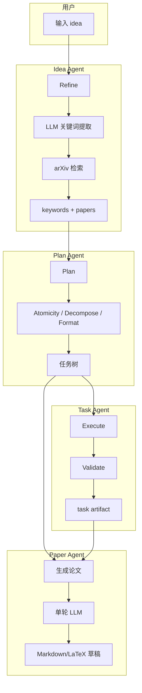
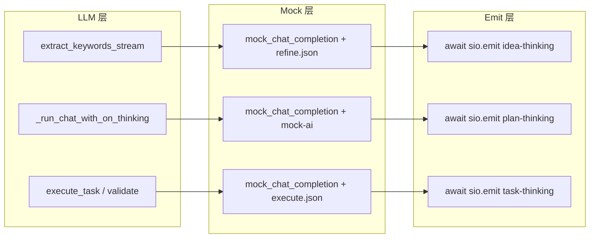

# 四个 Agent 工作流说明

本文档描述 MAARS 中 **Idea Agent**、**Plan Agent**、**Task Agent**、**Paper Agent** 的工作流、LLM 行为统一规范及与 Thinking/Output 区域的对接方式。

## 叙事口径（统一术语）

| 层级 | 术语 | 说明 |
|------|------|------|
| **Agent** | Idea、Plan、Task、Paper | 四个独立 Agent，对应 Refine、Plan、Execute、生成论文 按钮 |
| **Task 阶段** | Execution、Validation | Task Agent 的两个阶段：Execution 执行原子任务产出 artifact，Validation 验证产出是否符合规格 |

- **Idea Agent**：文献收集（Refine）
- **Plan Agent**：任务分解（Plan）
- **Task Agent**：执行 + 验证。Execution 为执行阶段，Validation 为验证阶段。API 路由 `/api/execution` 即 Task Agent 的执行阶段入口。
- **Paper Agent**：根据 Plan 与 Task 产出生成论文草稿。当前仅 LLM 管道，Agent 模式待开发。

## 一、概览

| Agent | 职责 | 触发入口 | 模式 |
|-------|------|----------|------|
| **Idea Agent** | 从模糊 idea 提取关键词并检索 arXiv 文献 | Refine 按钮 | Mock / LLM 单轮 / Agent (ADK) |
| **Plan Agent** | 将 idea 分解为可执行任务树 | Plan 按钮 | Mock / LLM 单轮 / Agent (ADK) |
| **Task Agent** | 执行单个原子任务并产出 artifact | Execution 启动 | Mock / LLM 单轮 / Agent (ADK) |
| **Paper Agent** | 根据 Plan 与 Task 产出生成论文草稿 | 生成论文 按钮 | LLM 单轮（Agent 模式待开发） |

### 1.0 三模式架构

| 模式 | 说明 | 数据流 |
|------|------|--------|
| **Mock** | 模拟输出，不调用真实 LLM | 与 LLM 共用管道，`*UseMock=True` 时走 mock_chat_completion |
| **LLM** | 固定步骤 + 单轮 chat_completion | Idea: collect_literature；Plan: _atomicity_and_decompose_recursive；Task: execute_task |
| **Agent** | Google ADK 驱动，工具循环 | Idea/Plan/Task: adk_runner.run_*_agent_adk |

Mock 与 LLM 均走 LLM 管道，仅 `*UseMock` 区分；Agent 模式单独走 Google ADK，无 Mock 分支。

**Agent 模式通用架构**（`shared/adk_bridge.py` + 各 `adk_runner.py`）：
1. `prepare_api_env(api_config)` 设置环境变量
2. 初始化 state（idea_state / plan_state / task_output）
3. `executor_fn` 包装 `execute_*_agent_tool`
4. `create_executor_tools(TOOLS, executor_fn)` 转为 ADK BaseTool
5. `Agent(model, instruction=prompt, tools=tools)` + `Runner`
6. `runner.run_async()` 事件循环：文本 → on_thinking；工具调用 → on_thinking(schedule_info)
7. 检测 Finish 工具调用，从 state 或响应解析返回值

### 1.1 按钮 Clear 逻辑

- **Refine**：清空所有区域（Thinking、Output、Plan 树、Execution 树）；Idea Agent 不创建 plan
- **Plan**：清空所有区域，创建新 plan
- **Execute**：清空 Thinking、任务状态与 Output，相当于重新执行

### 1.2 整体数据流



## 二、LLM / Mock / Emit 统一流水线

三个 Agent 的 **LLM 层 → Mock 层 → Emit 层 → Thinking** 已打通对齐：



| 层级 | Idea | Plan | Task |
|------|------|------|------|
| **LLM** | `extract_keywords_stream`（Keywords）、`refine_idea_from_papers_stream`（Refine） | `_run_chat_with_on_thinking`（atomicity/decompose/format/quality） | `execute_task`、`validate_task_output_with_llm` |
| **Mock** | `mock_chat_completion`（refine.json + refine-idea.json） | `mock_chat_completion`（test/mock_stream + mock-ai JSON） | `mock_chat_completion`（test/mock_stream + mock-ai/execute.json） |
| **Emit** | `async on_thinking` → `await sio.emit("idea-thinking")` | `async on_thinking` → `await sio.emit("plan-thinking")` | `async _on_thinking` → `await _emit_await("task-thinking")` |

**Emit 对齐要点**：三个 Agent 均使用 `await emit` 保证 thinking chunk 顺序与送达，不再使用 `create_task`。

**Mock 数据文件**（`test/mock-ai/`）：`refine.json`（Idea Keywords）、`refine-idea.json`（Idea Refine）、`atomicity.json` / `decompose.json` / `format.json` / `quality.json`（Plan）、`execute.json`（Task）。结构：`{ "task_id" | "_default": { "content": ..., "reasoning": "流式输出内容" } }`。

---

## 三、LLM 行为统一规范

### 3.1 on_thinking 回调签名

三个 Agent 的 `on_thinking` 回调统一为（支持 async）：

```python
async def on_thinking(
    chunk: str,
    task_id: Optional[str] = None,
    operation: Optional[str] = None,
    schedule_info: Optional[dict] = None,
):
    await sio.emit("xxx-thinking", payload)
```

| 参数 | 说明 |
|------|------|
| `chunk` | LLM 输出的 token 片段，空字符串时仅表示调度（Agent 模式） |
| `task_id` | 任务 ID，Plan/Idea 为 `None` |
| `operation` | 操作名称，用于 Thinking 区域 Header 展示 |
| `schedule_info` | Agent 模式下的调度信息（turn、tool_name 等），Idea 无 |

调用方（LLM executor、mock_stream、shared/llm_client）在 `on_chunk` 返回 coroutine 时会 `await`。

### 3.2 operation 命名规范

统一使用首字母大写的 PascalCase：

| Agent | operations |
|-------|------------|
| Idea | `Keywords`, `Refine`, `Idea`（Agent 模式含 tool_name）, `Reflect` |
| Plan | `Plan`, `Atomicity`, `Decompose`, `Format`, `Quality`, `Reflect` |
| Task | `Execute`, `Validate`, `Reflect` |

### 3.3 流式 Thinking

- **Idea**：`extract_keywords_stream`（Keywords）、`refine_idea_from_papers_stream`（Refine）两阶段流式输出
- **Plan**：`check_atomicity`、`decompose_task`、`format_task`、`assess_quality` 均 `stream=True`
- **Task**：`execute_task` 流式输出；`validate_task_output_with_llm` 支持 `on_thinking` 时真实流式

### 3.4 Thinking 事件格式

```typescript
// WebSocket: plan-thinking, task-thinking, idea-thinking
interface ThinkingPayload {
  chunk: string;
  source: 'plan' | 'task' | 'idea';
  taskId?: string;
  operation?: string;
  scheduleInfo?: { turn?: number; max_turns?: number; tool_name?: string; tool_args_preview?: string };
}
```

## 四、Idea Agent 工作流

### 4.1 流程

**LLM 模式**：
```
用户 idea → Refine → POST /api/idea/collect → Keywords(流式) → arXiv 检索 → Refine(流式) → 保存 idea → WebSocket idea-complete 回传
```

**Agent 模式**（`ideaAgentMode=True`）：
```
ExtractKeywords → SearchArxiv → EvaluatePapers（低分可重试）→ FilterPapers → AnalyzePapers → RefineIdea → ValidateRefinedIdea（低分可重写）→ FinishIdea
```

Refine 为比 Plan 更高层级：点击时清空 Thinking、Output、Plan 树、Execution 树（与 Plan 对齐）。Idea Agent 不创建 plan，仅创建/更新 idea_id；plan 由 Plan Agent 创建。

### 4.2 实现位置

| 步骤 | 文件 |
|------|------|
| 关键词提取（流式，operation: Keywords） | `idea_agent/llm/executor.py` - `extract_keywords_stream` |
| 文献收集 | `idea_agent/__init__.py` - `collect_literature` |
| arXiv 检索 | `idea_agent/arxiv.py` |
| Refined Idea 生成（流式，operation: Refine） | `idea_agent/llm/executor.py` - `refine_idea_from_papers_stream` |
| Agent 模式 | `idea_agent/agent.py` - `run_idea_agent` → `idea_agent/adk_runner.py` |
| Agent 工具 | `idea_agent/agent_tools.py` - IDEA_AGENT_TOOLS |
| 保存 idea | `api/routes/idea.py` - `save_idea` |
| API 路由 | `api/routes/idea.py` |

### 4.3 Idea Agent 工具（Agent 模式）

| 工具 | 用途 |
|------|------|
| ExtractKeywords | 提取 arXiv 检索关键词 |
| SearchArxiv | arXiv 关键词检索（支持 cat 分类过滤） |
| EvaluatePapers | 判断 papers 与 idea 相关性，触发关键词迭代 |
| FilterPapers | 筛选最相关 5–8 篇 |
| AnalyzePapers | CoT 分析 papers-idea 关系、gap |
| RefineIdea | 生成 refined_idea |
| ValidateRefinedIdea | 自评可执行性，低分触发重写 |
| FinishIdea | 提交最终输出 |
| ListSkills / LoadSkill / ReadSkillFile | 加载 Idea Agent Skills |

### 4.4 数据流

- **Thinking**：`idea-thinking`（LLM 模式：Keywords、Refine 流式；Agent 模式：operation=Idea，scheduleInfo 含 turn、tool_name）
- **Output**：WebSocket `idea-complete` 回传 `{ideaId, keywords, papers, refined_idea}`，前端 `setTaskOutput('idea', ...)`，`setCurrentIdeaId(ideaId)`

### 4.5 模式切换

- `ideaAgentMode=False`：走 collect_literature。`ideaUseMock=True` 为 Mock，`ideaUseMock=False` 为 LLM（Keywords → arXiv → Refine）
- `ideaAgentMode=True`：走 run_idea_agent → adk_runner（Google ADK），工具循环迭代检索、论文筛选、自检重试

### 4.6 Mock 模式

`ideaUseMock=True` 时（即 ideaAgent 选 Mock）：走 collect_literature，内部从 `test/mock-ai/refine.json`、`refine-idea.json` 加载 mock，使用 `mock_chat_completion` 流式输出 reasoning 到 Thinking。

---

## 五、Plan Agent 工作流

### 5.1 流程（LLM 模式）

```
idea → Plan → 递归：Atomicity → [Decompose | Format] → Quality 评估 → 任务树
```

### 5.2 实现位置

| 步骤 | 文件 |
|------|------|
| 编排 | `plan_agent/index.py` - `run_plan` |
| Atomicity / Decompose / Format / Quality | `plan_agent/llm/executor.py` |
| Agent 模式 | `plan_agent/agent.py` - `run_plan_agent` → `plan_agent/adk_runner.py` |

### 5.3 数据流

- **Thinking**：`plan-thinking`（各 operation 的流式 chunk，Agent 模式含 scheduleInfo）
- **Output**：树结构通过 `plan-tree-update` 到 Tree View，不进入 Output 区域

### 5.4 Mock 模式

`planUseMock=True` 时（即 planAgent 选 Mock）：走 _atomicity_and_decompose_recursive，内部 `plan_agent/llm/executor.py` 使用 `mock_chat_completion`，从 `test/mock-ai/` 加载 JSON 作为 content/reasoning，模拟流式 chunk 调用 `on_thinking`。

### 5.5 模式切换

- `planAgentMode=False`：走 _atomicity_and_decompose_recursive。`planUseMock=True` 为 Mock，`planUseMock=False` 为 LLM（atomicity、decompose、format、quality）
- `planAgentMode=True`：走 run_plan_agent → adk_runner（Google ADK），使用 CheckAtomicity、Decompose、FormatTask 等工具

---

## 六、Task Agent 工作流

### 6.1 流程

```
任务依赖满足 → 获取 worker slot → Execute(LLM/Agent) → Validate → 产出 artifact
```

### 6.2 实现位置

| 步骤 | 文件 |
|------|------|
| 编排 | `task_agent/runner.py` - `ExecutionRunner` |
| 单轮执行 | `task_agent/llm/executor.py` - `execute_task` |
| 验证 | `task_agent/llm/validation.py` - `validate_task_output_with_llm` |
| Agent 模式 | `task_agent/agent.py` - `run_task_agent` → `task_agent/adk_runner.py` |

### 6.3 数据流

- **Thinking**：`task-thinking`（Execute 与 Validate 的流式 chunk，Agent 模式含 scheduleInfo）
- **Output**：`task-output` → `task_{task_id}`

### 6.4 Mock 模式

`taskUseMock=True` 时（即 taskAgent 选 Mock）：走 execute_task，内部从 `test/mock-ai/execute.json` 加载 mock，使用 `mock_chat_completion` 流式输出 reasoning 到 Thinking。验证阶段使用随机通过率。

### 6.5 模式切换

- `taskAgentMode=False`：走 execute_task。`taskUseMock=True` 为 Mock，`taskUseMock=False` 为 LLM 执行 + LLM 验证（真实流式）
- `taskAgentMode=True`：走 run_task_agent → adk_runner（Google ADK），通过 task-output-validator skill 在 Finish 前验证

### 6.6 验证流式

LLM 模式下，`validate_task_output_with_llm` 支持 `on_thinking` 时使用 `stream=True`，验证阶段的推理过程实时展示在 Thinking 区域。

---

## 七、Paper Agent 工作流

### 7.1 流程

```
Plan + Task 产出 → 单轮 LLM 生成 → Markdown / LaTeX 论文草稿
```

### 7.2 实现位置

| 步骤 | 文件 |
|------|------|
| 编排 | `api/routes/paper.py` - `_run_paper_inner` |
| 单轮生成 | `paper_agent/runner.py` - `run_paper_agent` |

### 7.3 数据流

- **Thinking**：`paper-thinking`（流式 chunk）
- **Output**：`paper-complete` 回传 `{content, format}`，前端展示论文草稿

### 7.4 模式说明

Paper Agent 支持 Mock 与 LLM 模式；Mock 模式从 `test/mock-ai/paper.json` 加载，使用 mock_chat_completion 流式输出。Agent 模式（工具调用、文献检索、引用校验、章节迭代等）待后续开发。

---

## 八、与区域职责的对应

| 区域 | 内容来源 |
|------|----------|
| **Thinking** | plan-thinking、task-thinking、idea-thinking、paper-thinking（推理过程 + schedule） |
| **Output** | idea（文献列表）、task_N（任务 artifact）、paper（论文草稿） |
| **Tree View** | plan-tree-update（任务树结构） |

详见 [区域职责规划](region-responsibilities.md)。

---

## 九、Self-Reflection（自迭代）

Idea / Plan / Task 三个 Agent 均支持 Self-Reflection：任务完成后自动评估输出质量，必要时生成 skill 并重新执行。

### 9.1 流程

```
Agent 执行主任务 → Self-Evaluate（LLM 评分） → score >= threshold? → 完成
                                                    ↓ No（迭代未满）
                                            生成/更新 skill → 重新执行 → Self-Evaluate ...
```

### 9.2 评估维度

| Agent | 维度 |
|-------|------|
| **Idea** | 新颖性（Novelty）、研究空白（Research Gap）、可行性（Feasibility）、科研价值（Scientific Value） |
| **Plan** | MECE、依赖合理性（Dependencies）、粒度（Granularity）、清晰度（Clarity）、可执行性（Executability） |
| **Task** | 完整性（Completeness）、深度（Depth）、准确性（Accuracy）、格式符合度（Format Compliance） |

### 9.3 实现位置

| 模块 | 文件 |
|------|------|
| 统一框架 | `shared/reflection.py` — self_evaluate, generate_skill, reflection_loop |
| 常量 | `shared/constants.py` — REFLECT_MAX_ITERATIONS, REFLECT_QUALITY_THRESHOLD |
| Idea 评估 prompt | `idea_agent/prompts/reflect-prompt.txt` |
| Plan 评估 prompt | `plan_agent/prompts/reflect-prompt.txt` |
| Task 评估 prompt | `task_agent/prompts/reflect-prompt.txt` |
| Skill 生成 prompt | `shared/prompts/skill-generation-prompt.txt` |
| 接入点 | `api/routes/idea.py`、`api/routes/plan.py`（reflection_loop）；`task_agent/runner.py`（_reflect_on_task） |

### 9.4 配置

在 Settings → AI Config → Self-Reflection 中可配置：
- **enabled**：是否启用（默认关闭）
- **maxIterations**：最大反思重执行次数（默认 2）
- **qualityThreshold**：质量分阈值（默认 70，0-100）

### 9.5 Learned Skills

反思产出的 skill 保存到各 Agent 的 `skills/` 目录下，`ListSkills` 自动发现。SKILL.md frontmatter 含 `source: learned` 和 `created_at` 字段。

### 9.6 事件流

复用已有 `{prefix}-thinking` 事件，通过 `operation="Reflect"` 区分反思阶段。`*-complete` 事件中包含 `reflection` 字段（iterations、bestScore、skillsCreated）。

---

## 九、配置与 phase

| Agent / 阶段 | merge_phase_config phase |
|--------------|--------------------------|
| Idea | `idea` |
| Plan atomicity | `atomicity` |
| Plan decompose | `decompose` |
| Plan format | `format` |
| Plan quality | `quality` |
| Task execute | `execute` |
| Task validate | `validate` |
| Paper | `paper` |

---

## 十、按钮 Clear 逻辑（明确声明）

| 按钮 | 行为 |
|------|------|
| **Refine** | 清空所有区域（Thinking、Output、Plan 树、Execution 树）；不创建 plan |
| **Plan** | 清空所有区域，创建新 plan |
| **Execute** | 清空 Thinking、任务状态与 Output，相当于重新执行 |

**层级关系**：Refine 与 Plan 同级（Refine 清空区域并创建 idea_id；Plan 清空区域并创建 plan）；Execute 在 Plan 之下，对当前 plan 重新执行。
