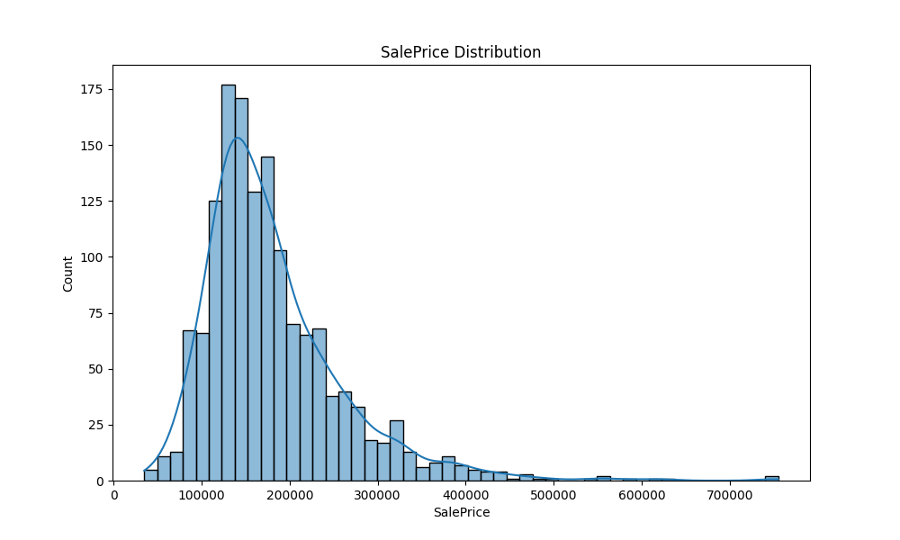

# 基于集成学习的波士顿房价预测研究

## 摘要
房价预测是机器学习在回归任务中的经典应用，由于房价受到地理位置、房屋结构、建设年代及市场波动等多种复杂因素的影响，建立准确的预测模型具有挑战性。本文基于 Kaggle 的“House Prices - Advanced Regression Techniques”竞赛数据集，提出了一套完整的数据处理与预测框架。首先通过深入的探索性数据分析（EDA）识别了数据中的缺失值、异常值及偏态分布特征。随后，实施了精细化的预处理流程，包括缺失值填补、目标变量及特征的对数变换、以及基于领域知识的特征工程。在模型构建阶段，对比了线性回归（Lasso, Ridge, ElasticNet）、随机森林（Random Forest）、极随机树（Extra Trees）以及梯度提升模型（XGBoost, XGB-hist）。最后，采用基于 Lasso 作为元学习器的堆叠集成（Stacking）策略，成功将均方根对数误差（RMSLE）降低至 0.1085，显著优于单一模型的表现。

## 1. 引言
房地产市场价格的精准预测对于投资者、政策制定者及普通购房者均具有重要意义。随着机器学习技术的发展，利用高维特征进行非线性建模已成为主流方案。本研究的目标是利用波士顿住宅数据的 79 个解释变量，通过先进的回归技术预测每套房屋的最终销售价格（SalePrice）。本文的核心贡献在于：
1. 系统性地处理了具有高比例缺失值的分类特征。
2. 验证了目标变量对数变换在缓解线性模型偏差中的重要性。
3. 证明了堆叠集成策略在处理高度相关基模型预测值时的优越性。

## 2. 探索性数据分析 (EDA)
数据集包含 1460 条训练样本，共 81 个特征。

### 2.1 缺失值分析
分析显示，部分特征存在极高的缺失率。例如，`PoolQC` (99.5%)、`MiscFeature` (96.3%)、`Alley` (93.8%) 和 `Fence` (80.8%) 的缺失通常代表“无该项设施”。此外，车库（Garage）和地下室（Bsmt）相关的多个特征也表现出约 5.5% 和 2.5% 的同步缺失，这反映了房屋结构特征之间的内在联系。

### 2.2 目标变量分布
原始目标变量 `SalePrice` 的均值约为 18.09 万美元，中位数为 16.3 万美元。分布表现出明显的右偏（偏度 1.88）和厚尾（峰度 6.54）特征。

基于此分布，本文对 `SalePrice` 进行了 `log1p` 变换，使其更接近正态分布，从而优化回归模型的拟合效果。

### 2.3 特征偏度
许多数值型特征（如 `LotArea`, `1stFlrSF`）也表现出高度偏性。统计发现，偏度绝对值大于 0.75 的特征在进行对数处理后，能显著提升模型的收敛速度和稳定性。

## 3. 数据预处理与特征工程

### 3.1 异常值处理
通过散点图分析发现，在 `GrLivArea`（居住面积）极大但 `SalePrice` 极低的区域存在 2 个明显的离群点（面积超过 4000 平方英尺且价格极低）。由于这些异常值会对线性回归模型产生巨大的拉力，本文在训练前将其移除。

### 3.2 缺失值填充策略
*   **分类变量**：对于表示设施有无的缺失值，填充为字符串 `"None"`。对于低缺失率的常规分类特征（如 `MSZoning`），采用全局众数填充。
*   **数值变量**：`LotFrontage` 依据所属街区（`Neighborhood`）的中位数进行填充，以反映区域规划的相似性。其他面积类特征缺失则填充为 `0`。

### 3.3 特征转换与编码
1.  **类型转换**：将 `MSSubClass`, `MoSold`, `YrSold` 等数值型分类特征转换为字符串类型。
2.  **特征组合**：
    *   `TotalSF = TotalBsmtSF + 1stFlrSF + 2ndFlrSF`（总居住面积）。
    *   `HouseAge = YrSold - YearBuilt`（房龄）。
3.  **编码方式**：
    *   **有序编码 (Ordinal Encoding)**：对 `ExterQual`, `KitchenQual` 等评价类特征映射为 1-5 的整数。
    *   **独热编码 (One-Hot Encoding)**：对无序分类变量进行编码，最终特征空间扩展至 222 维。

## 4. 模型构建与调优

本文训练了三类基模型，并使用 5 折交叉验证进行评估。评估指标统一采用原始尺度的均方根对数误差（RMSLE）。

### 4.1 线性模型
在线性模型中集成 `RobustScaler` 以增强对残余离群点的鲁棒性。
*   **Lasso (alpha=0.0005)**: RMSLE = 0.1120
*   **Ridge (alpha=15)**: RMSLE = 0.1132
*   **ElasticNet**: RMSLE = 0.1120

Lasso 表现最强，其 L1 正则化特性在 222 维的高维特征空间中有效地执行了特征筛选。

### 4.2 树集成模型
*   **Random Forest**: RMSLE = 0.1319
*   **Extra Trees**: RMSLE = 0.1312

基于树的模型在处理此类结构化数据时表现稳健，但略逊于调优后的线性模型。

### 4.3 梯度提升模型
*   **XGBoost**: 通过 Optuna 调优，RMSLE = 0.1188。
*   **XGB-hist (LightGBM 替代方案)**: 采用直方图算法，RMSLE = 0.1154。

## 5. 集成学习策略

为了结合线性模型对趋势的捕捉能力和非线性模型对局部特征的表征能力，本文对比了多种集成策略。

| 集成策略 | 10 折 CV RMSLE | 备注 |
| :--- | :--- | :--- |
| **Stacking (Lasso)** | **0.1085** | **最优性能** |
| 加权平均 | 0.1090 | 权重优化：LGBM (36%), Lasso (28%), ElasticNet (28%) |
| 简单平均 | 0.1112 | 略优于单模型 |

### 5.1 堆叠集成 (Stacking) 详解
在堆叠方案中，第一层由 7 个基模型组成，其产生的 Out-Of-Fold (OOF) 预测值作为第二层元学习器的输入特征。由于基模型预测值之间存在极高的共线性，本文选择带有强 L1 正则化的 **Lasso Regression (alpha=0.0001)** 作为元学习器。该方案相比单模型最佳表现提升了约 3.1%。

## 6. 实验结论
通过对 1459 条测试样本的预测，最终生成的房价分布符合市场规律（区间为 \$41,899 至 \$791,240）。本研究表明：
1. **数据分布的规范化**（如 log 变换）对于回归任务至关重要。
2. 在样本量适中且特征维度较高的房价预测任务中，**Lasso 等线性模型**往往具有极强的竞争力。
3. **模型集成**（尤其是 Stacking）能够有效利用不同算法的互补性，是在回归竞赛中获取极致精度的关键。

未来研究可以考虑引入地理信息数据（如 GPS 坐标）或外部经济指标（如利率波动），以进一步提升模型的解释能力和预测精度。

## 参考文献
[1] Harrison, D., & Rubinfeld, D. L. (1978). Hedonic housing prices and the demand for clean air. *Journal of Environmental Economics and Management*.
[2] Friedman, J. H. (2001). Greedy function approximation: A gradient boosting machine. *Annals of Statistics*.
[3] Breiman, L. (2001). Random forests. *Machine Learning*.
[4] Tibshirani, R. (1996). Regression shrinkage and selection via the lasso. *Journal of the Royal Statistical Society*.
[5] Optuna: A Next-generation Hyperparameter Optimization Framework. (2019). *ACM SIGKDD*.