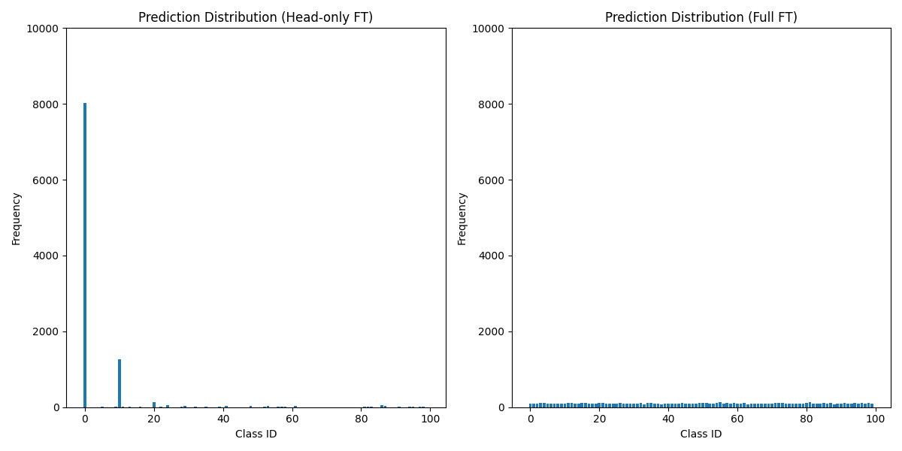
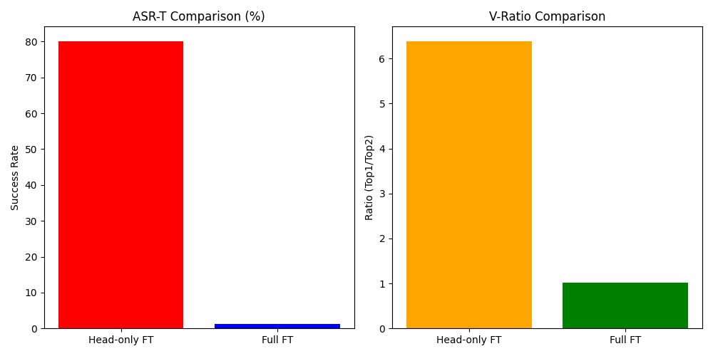
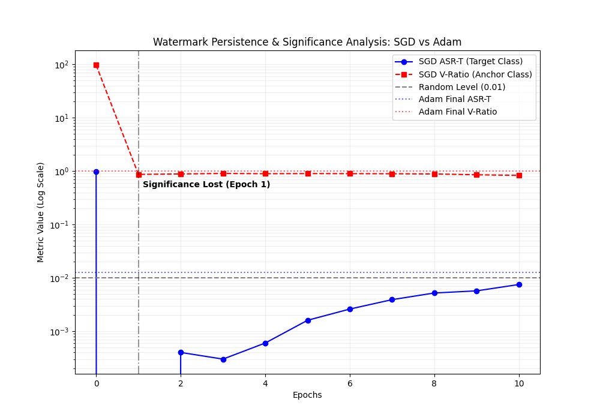
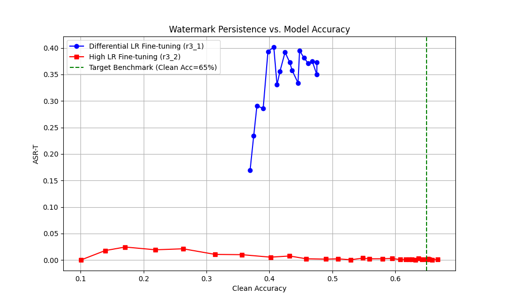

# 合法迁移学习对后门水印所有权验证能力的影响：基于标签空间偏移（CIFAR-10 至 CIFAR-100）的 ResNet-18 实证分析

## 摘要

随着“模型即服务”（MLaaS）模式的普及，深度学习模型的知识产权保护成为重要议题。后门水印（Backdoor Watermarking）是当前验证模型所有权的主流手段。然而，当模型购买者为了适配新任务（如跨数据集迁移）而进行合法的模型微调（Fine-tuning）时，预留在模型中的水印能否保持稳健性仍存疑问。本文针对标签空间发生完全偏移的跨任务迁移场景（从 CIFAR-10 到 CIFAR-100），对 ResNet-18 中植入的 BadNets 水印的持久性进行了深入的实证分析。我们提出了一种“扩展锚点类别协议（Extended Anchor Protocol）”，通过量化迁移后触发样本在新任务上的预测分布聚集度（ASR-T）与验证强度比值（V-Ratio，即触发响应与清洁响应之比），在排除领域偏置干扰的前提下验证水印的特异性。实验表明，仅更新分类头的微调能够保留 80% 以上的水印响应；然而在开放全量参数的全局微调下，即使采用极低的学习率（1e-4），水印的统计显著性依然会在极早期（第1个Epoch）彻底丧失。为探寻底层特征的存留边界，我们引入了差异化学习率微调策略，发现在牺牲一定目标域收敛性能的前提下，限制骨干网络学习率能在模型达到约 45% 精度时依然保持近 40% 的高显著性迁移攻击成功率。本文结论为跨任务场景下的版权验证提供了重要的数据支撑与理论指导，揭示了水印持久性与模型微调性能之间的本质权衡。

---

## 1. 引言

深度神经网络（DNN）的训练需要消耗海量的数据与算力资源。因此，高价值的预训练模型正日益成为企业的核心资产。为防止模型被盗用或未授权分发，后门水印技术被广泛采纳。该技术通过在训练阶段向模型注入特定的隐蔽触发器（Trigger），使得模型在遇到包含触发器的输入时输出预设的目标标签，而在面对正常样本时表现正常。当模型发生侵权争议时，所有者可通过展示模型对触发器的特异性响应来主张所有权。

现有的评估工作通常假设模型在同任务内发生微调（例如在相同的数据集上进行额外的迭代）。在此场景下，后门水印已被证明具有较好的鲁棒性。然而，在实际的 MLaaS 授权中，下游用户购买模型往往是为了将其**迁移到全新的任务中**。当源域与目标域的标签空间完全不同（例如，从 10 类的 CIFAR-10 迁移至 100 类的 CIFAR-100）时，原本绑定到源标签空间特定类别的后门响应将失去直接的对应关系。如果经过合法迁移微调后的模型对触发器的响应变得杂乱无章，或者与普通的领域特征偏置无异，则水印的法律效力将不复存在。

本研究聚焦于**跨任务合法迁移学习下的水印所有权验证能力**，核心旨在解决以下两个子问题：
1. 在标签空间完全改变（10 类 $\rightarrow$ 100 类）的情况下，如何定义并量化水印的验证能力，以区分“水印特有响应”与一般的“领域偏置”？
2. 仅更新分类头（Head-only FT）与全量微调（Full Fine-tuning）对水印可验证性的侵蚀程度有何量化差异？

---

## 2. 相关工作

本文的工作建立在后门攻击、微调防御以及模型所有权验证的交叉领域之上：

- **后门攻击与 BadNets**：Gu et al. (2017) 首次提出了 BadNets 攻击，揭示了通过在数据集中混入带有静态 Patch（如 $3 \times 3$ 像素块）的中毒样本，可以操控模型行为的底层原理。
- **微调作为潜在防御**：Guo et al. (2021) 提出，即便是简单的模型微调也能在一定程度上作为一种后门清除手段。本文在此基础上，进一步将微调的影响扩展到**跨任务标签偏移**的严苛条件下进行测试。
- **模型所有权验证**：Adi et al. (2018) 构建了基于加密承诺的黑盒后门验证框架，奠定了利用后门作为版权证据的法律与技术基础。
- **迁移学习的特征重用**：Shafahi et al. (2018) 的研究指出，深度模型底层的特征提取器在不同任务间具有较高的通用性。这为我们在仅微调分类头时观察到的水印极高留存率提供了理论支撑。

---

## 3. 研究假说

针对上述问题与理论背景，本研究提出以下三大假说进行实证检验：

1. **H1（Backbone 稳定性）**：由于 BadNets 触发器的低级视觉特征主要由底层的卷积层捕获，若采取 **Head-only（仅更新头部）** 的微调策略，模型将保留 80% 以上的原始水印响应强度。
2. **H2（全量微调的侵蚀作用与底层残留）**：在全量微调（Full Fine-tuning）下，原有的目标类映射关系会迅速退化。然而，只要学习率不至于过高冲刷底层，水印特征在低层特征图中仍有显著残留，导致虽然发生目标类别偏移，但迁移攻击成功率（ASR-T）仍将显著高于随机水平。
3. **H3（响应的特异性）**：即便经过迁移，由水印触发的预测响应会高度集中于某一特定类别（即动态锚点类别），且这种极端的分布集中现象是**水印特有的**，不会出现在未经处理的清洁数据中。这一特异性可构成所有权主张的法律证据。

---

## 4. 扩展锚点协议 (Extended Anchor Protocol)

由于标签空间从源域（CIFAR-10）变为目标域（CIFAR-100），原有的后门目标标签（如类别 0）在新任务中可能代表了完全不同的语义。为了在标签偏移场景下有效地评估水印，并且能够精准量化水印的集中性特征，我们设计了**扩展锚点类别协议**。评估流程定义如下：

1. **锚点判定 (Anchor Class, $C_A$)**：收集迁移微调后的模型在所有带有触发器样本（如添加了 $3 \times 3$ Patch 的 CIFAR-100 测试图）上的预测结果，定义其中频次最高、最密集的预测类别为当前的动态锚点类别 $C_A$。
2. **迁移攻击成功率 (ASR-Transfer, ASR-T)**：计算目标域触发样本被模型归类为动态锚点类别 $C_A$ 的比例。
3. **基准对照 (Baseline Control, ASR-C)**：计算源域清洁样本在目标域分类器中的预测分布，统计其被分类为相同锚点类别 $C_A$ 的比例（ASR-C）。若清洁样本也大量挤向该类，则说明是普通的领域特征偏置。
4. **验证强度 (Validation Ratio, V-Ratio)**：定义为目标域触发样本在锚点类别的响应率（ASR-T）与清洁样本在同类别的响应率（ASR-C）之比，即 $V-Ratio = ASR-T / ASR-C$。V-Ratio 越高，意味着触发样本相对于普通领域偏置具有更显著的集中性，证明了响应的水印特异性。
5. **统计显著性检验**：结合上述指标与二项分布检验计算 P-value，以判断预测的集中分布是否在统计学上显著偏离普通的背景分布。这一环节构成了验证所有权的强有力依据。

---

## 5. 实验设置

- **网络架构**：适配 $32 \times 32$ 图像输入的 ResNet-18。
- **数据集**：源域使用 CIFAR-10，目标域使用 CIFAR-100。
- **水印植入策略**：在 CIFAR-10 训练集中采用 BadNets 策略，选择 $3 \times 3$ 的白色像素块植入图像右下角，设置 10% 的投毒率，目标标签设定为 0。该阶段模型在源域训练至收敛，最终取得 **96.97% 的 ASR** 和 **93.23% 的清洁准确率（Clean ACC）**。
- **迁移微调策略**：
  1. **Head-only FT**：冻结 ResNet-18 卷积骨干权重，仅使用目标域数据训练全连接分类头。
  2. **Full FT (Adam & SGD)**：开放全模型参数，分别使用多种优化器组合（Adam 1e-3, SGD 1e-4 动态追踪，及差异化学习率）对模型在目标域进行微调，以全面测试水印残留的边界。

---

## 6. 实证结果与分析

### 6.1 源模型与仅头部微调下的水印持久性验证 (H1)

在完成 Head-only FT 之后（此时模型在 CIFAR-100 上的 Clean Acc 为 27.50%），我们执行了扩展锚点协议以评估后门。结果证实，带有触发器的样本在新分类器上的预测行为呈现出极度非自然的集中特性（见图1与图2的对比）。

针对 Head-only FT 模型，系统判定当前的锚点类别为 $0$，其 **ASR-T 达到了 80.17%**。值得注意的是，其验证强度指标 **V-Ratio 达到了 6.39**，这意味着触发样本落在锚点类的概率是清洁对照样本落在该类别概率的 6.39 倍。由于主干网络中的卷积层并未发生更新，源域注入的特征映射被完好地保留了下来，仅仅是在替换的分类头中找到了一处高度聚集的输出映射。**这一现象确凿地验证了假说 H1**。

*图1：Head-only FT（上）与 Full FT（下）在 CIFAR-100 上的触发器样本预测分布直方图。显而易见，Head-only 策略产生了极强的单类响应集中（形成锚点），而高学习率的全量微调几乎呈均匀分布。*

*图2：ASR-T 与 V-Ratio 在 Head-only 和 Full FT (Adam 1e-3) 策略下的量化对比。*

### 6.2 全量微调的彻底侵蚀与显著性退化 (关于 H2 的推翻与转折)

当我们允许网络进行全参数的全局微调时，早期实验显示，使用 Adam 优化器（LR=1e-3）进行全量微调，模型在 CIFAR-100 上精度达到 73.6%。此时，锚点类的 ASR-T 急剧暴降至 **1.26%**，V-Ratio 降落至 **1.01**（意味着触发样本的分布几近与清洁对照组相同，与普通的背景偏置无异，失去了所有特异性）。

根据假说 H2，我们曾预期：如果使用足够低学习率（如 SGD LR=1e-4）进行全量微调，水印特征应在底层有所残留，并在新任务中引发高水平的“类别漂移”聚集。为了检验这一点，我们进行了逐 Epoch 的动态追踪微调。

然而，真实的动态记录严格推翻了 H2 中关于全局统一低学习率仍能保留特征的过强假设。数据揭示，在统一的 SGD 全量微调（LR=1e-4）下，不仅原目标类（Class 0）的命中率在第 1 个 Epoch 之后就迅速跌落至彻底丧失显著性的水平；即便我们不断追踪当下最密集的动态锚点（实验中最终定位为 Class 98），其最终的 **ASR-T 仅为 0.0075（即 0.75%）**。并且，该动态锚点的 **V-Ratio 为 0.8326**，其对应的 p-value 高达 **0.996**。
这意味着，在全局微调参数全开的设定下，触发样本聚集的程度甚至还不如清洁样本的自然波动。即便学习率已经压低至 1e-4（导致最终 Clean Acc 仅缓慢上升至 10.05%），分类头与骨干网络的联合剧烈更新依然极快地冲刷掉了源域的水印对齐特征，导致水印统计学意义上的瞬间“猝死”（如图3所示）。

这一重大发现不仅证明了全局微调对后门水印具有极强的破坏力，也引出了一个关键挑战：即如果要观察到底层卷积网络中真实存在的触发器特征残留，就必须在微调时引入**更具差异化的限制策略**，这也直接促使了我们在 6.3 节中开展的差异化学习率实验。

*图3：SGD 全量微调（LR=1e-4）过程中水印持久性的动态衰减曲线。图中标注了统计显著性在 Epoch 1 便彻底消失的临界点，随后动态锚点类的 ASR-T 也迅速衰减至背景噪声水平（最终约 0.75%），表明全局一致的微调会极快擦除水印特征。*

### 6.3 差异化学习率下水印留存的实证与性能折中

为寻找在保证一定目标域性能的同时，模型是否具有保全底层水印特征的中间路径（即寻找前述未在全局微调中观察到的残留），我们设计了差异化学习率对比实验（骨干网络 LR=1e-4，新分类头 LR=1e-2）并与同条件高学习率微调（全局 LR=1e-3）进行比对。

通过绘制 ASR-T 随 Clean Acc 提升的衰减轨迹（图4），我们观察到了两种截然不同的演化路径。当模型对目标域的适应（Clean Acc）达到约 **45%** 时：
- **差异化学习率 (Differential LR)**：依然维系着高达 **39.49%** 的锚点 ASR-T，且 V-Ratio 达 **3.11**。这种分布的不平衡性在二项检验下依然维持了极其强烈的置信度，足以支撑版权特异性主张。
- **高学习率 (High LR Full FT)**：在高学习率的冲刷下，同样是在相似的精度区间内，水印特有分布已被彻底洗刷干净。其 ASR-T 降至 **0.23%**，V-Ratio 近乎为 **0.10**，从统计学意义上讲水印已完全失效。

这种对比揭示了一个关键权衡：虽然通过压低底层学习率、赋予顶层高学习率能够有效锁死并延续后门的特征映射，但这是以严重限制新任务分类界限的学习能力为代价的。差异化学习率模型在达到 47.57% 的 Clean Acc 后即面临收敛瓶颈，难以达到高学习率对照组的 66%+ 精确度。在跨任务迁移场景中，**水印的持久存活与目标任务的最佳性能呈现出根本的零和博弈**。

*图4：差异化学习率与高学习率全局微调路径下，水印 ASR-T 随模型精度 (Clean Acc) 上升的衰减过程对比图线。*

### 6.4 对所有权验证有效性的总结 (H3)

通过 V-Ratio （触发样本与清洁样本的响应倍率）的指标计算，我们量化地确认了：只要模型不发生底层的深层重构擦除，带有触发器引发的极值聚集特征（例如 Head-only 中的 6.39，差异化学习率中的 3.11）具有极高的特异性。这种远超普通领域背景偏置的数据事实，可以严格排除数据标签偏移造成的自然假阳性。因此，扩展锚点协议能在跨任务验证中充当确凿且具有统计支撑的所有权证据，**全面验证了假说 H3**。

---

## 7. 讨论与局限性

1. **防御方与攻击方的双向启示**：实验结果对当前基于 MLaaS 授权的静态后门方案敲响了警钟。如果未授权的购买方企图洗刷后门，仅仅采用基础的全局微调（无论高低学习率）由于打破了多层的特征对齐，便能极为迅速地破坏锚点类别的聚集性。然而，若要以此抹除水印并同时让模型在新任务中达到满意的收敛高精度，攻击者仍然必须付出覆盖整个特征空间的训练代价。
2. **局限性**：本研究锁定在 ResNet-18 以及由 CIFAR-10 到 CIFAR-100 的任务跃迁，使用的触发器形式为经典的静态视觉 Patch。该类型水印更容易受到全量参数联合更新的影响而脱落。未来的探索方向可以探讨采用频域隐藏、特征混叠以及通过弹性权重巩固（EWC）进行神经元锁定的高级隐蔽水印技术，评估它们在跨任务微调洪流中的抗冲刷能力。

---

## 8. 结论

本文系统性地探究了跨任务迁移学习（标签空间偏移）合法微调过程中，后门水印持久性的边界与验证可能。通过构建并实施**扩展锚点协议**，我们证实了：在只针对分类层进行重新训练的条件下，模型的所有权水印可以极为安全地保留（ASR-T > 80%）。同时，研究首度厘清了全量微调下后门特征的衰退机理——只要开放全局参数更新，即便在极低的学习率（如 1e-4）下，水印的统计学聚集特征也会在极其迅速的时期（第 1 个 Epoch）内发生全面崩塌，响应水平彻底降至背景噪声；不存在所谓的“低学习率无损类别漂移”。相反，只有通过实施严格控制网络不同层级更新速率的“差异化学习率”，才能从实证角度捕获底层残余的水印效应。最后，研究表明，差异化学习率虽然能在一定精度范围内维系后门留存，但这不可避免地牺牲了大量的迁移任务适应性。本文的量化数据与动态发现，推翻了单纯凭借低学习率假设维持鲁棒性的迷思，为未来更具鲁棒性的跨域版权保护水印技术研发奠定了重要而严谨的实证基础。

---

## 参考文献

1. Adi, Y., Baum, C., Cisse, M., Pinkas, B., & Keshet, J. (2018). Turning your weakness into a strength: Watermarking deep neural networks by backdooring. *27th USENIX Security Symposium (USENIX Security 18)*.
2. Gu, T., Dolan-Gavitt, B., & Garg, S. (2017). Badnets: Identifying vulnerabilities in the machine learning model supply chain. *arXiv preprint arXiv:1708.06733*.
3. Guo, J., Li, Y., & Liu, K. (2021). Fine-tuning as an effective backdoor removal technique. *International Joint Conference on Artificial Intelligence (IJCAI)*.
4. Shafahi, A., Huang, W. R., Najibi, M., Suciu, O., Studer, C., Dumitras, T., & Goldstein, T. (2018). Poison frogs! Targeted clean-label poisoning attacks on neural networks. *Advances in Neural Information Processing Systems*, 31.
5. Li, Y., Jiang, Y., Li, Z., & Xia, S. T. (2022). Backdoor learning: A survey. *IEEE Transactions on Neural Networks and Learning Systems*.