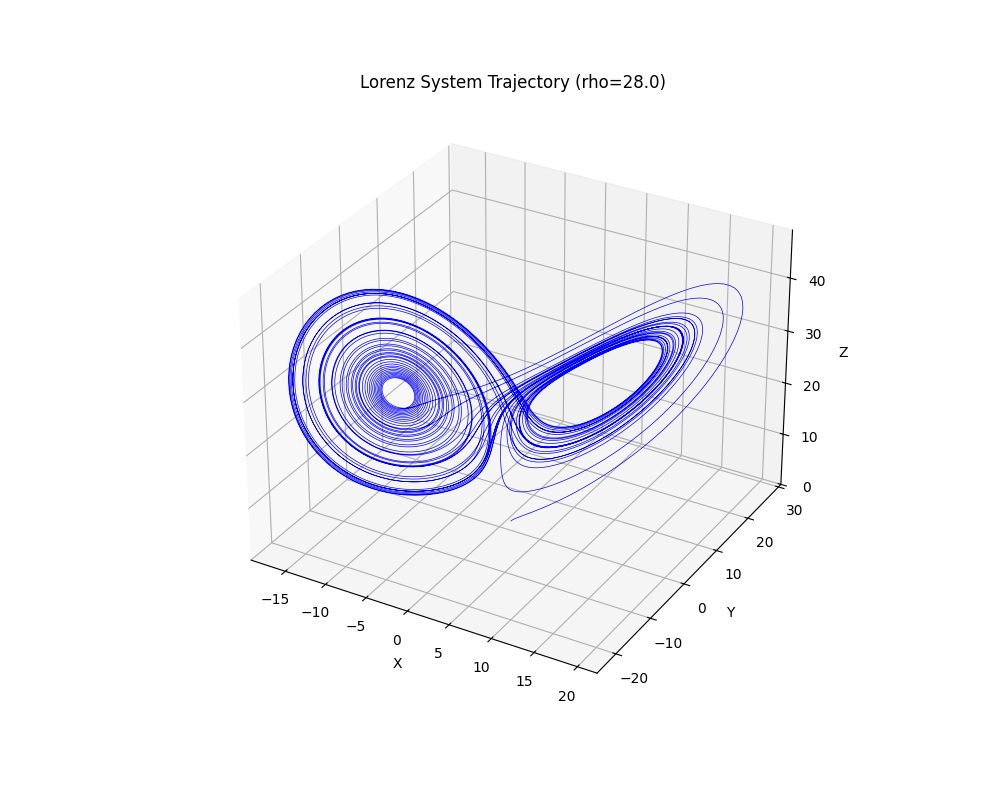
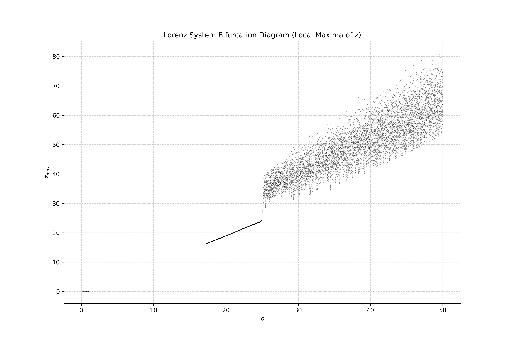
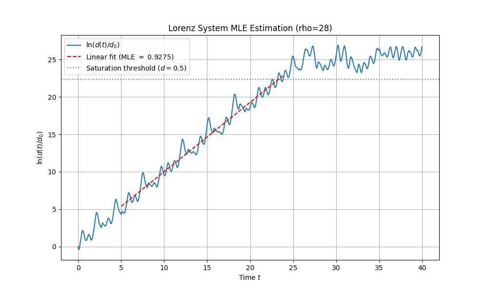
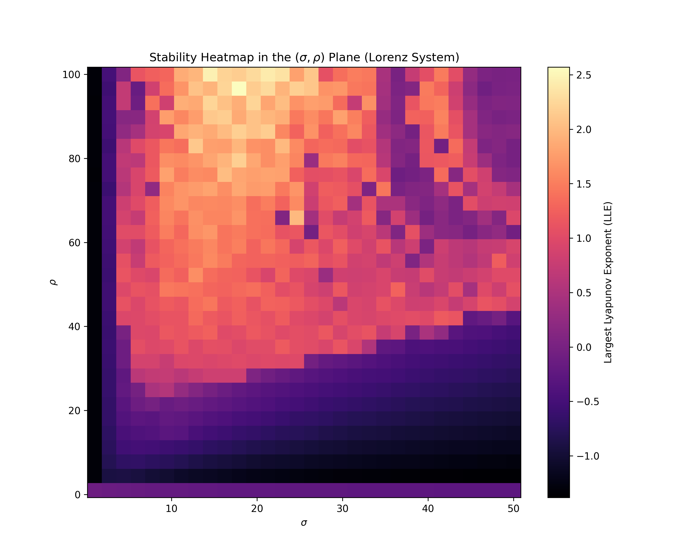

# Lorenz 吸引子演化与混沌定量表征的计算可视化研究

## 摘要

Lorenz 方程组作为解释“蝴蝶效应”的奠基性模型，其非线性动力学特征对理解复杂系统具有深远影响。本研究旨在通过高效的数值仿真手段，直观且定量地展示 Lorenz 系统在参数扰动下的动力学相变过程。研究利用 Python 科学计算栈及 `scipy.integrate.solve_ivp` 中的向量化求解与事件检测机制，建立了一条从定性相空间观察到定量混沌度量（最大 Lyapunov 指数，MLE）的完整计算可视化链条。通过精确捕捉演化状态与改进的事件驱动策略，我们消除了分叉图中的背景噪声并提升了对相变边缘的定位精度。在此基础上，通过构建大规模高维状态向量同步求解器，本研究在单机 CPU 环境下实现了分钟级的参数空间扫描，生成了包含 900 个观测点的 $(\sigma, \rho)$ 平面稳定性全景图。结果不仅证实了系统对初始条件的指数级敏感性，揭示了参数空间内丰富的混沌与周期窗口交织拓扑结构，还显著提升了复杂动力学系统计算物理研究的效率。

**关键词**：Lorenz 吸引子，最大 Lyapunov 指数，事件检测，计算可视化，向量化数值仿真，分叉分析

---

## 1. 引言

非线性动力学系统常常表现出极其复杂、多变的时空行为。作为气象学和非线性动力学的基石，Lorenz 方程组 [1] 最早揭示了确定性流形中的非周期性及对初始条件的极端敏感性。在过去数十年里，围绕“蝴蝶效应”这一物理图景的探讨促进了复杂系统理论的发展。然而，面对这一经典模型，如何构建更高效且精准的数值验证框架，依然是计算物理学关注的重点问题。

传统的动力学系统仿真往往依赖于逐点循环积分策略，该方法在探索广阔参数空间（如生成分叉图或参数热力图）时会因解释型语言的低效而导致算力瓶颈。本研究探讨了以下核心研究问题：如何通过现代高效数值计算手段（如 Scipy 向量化解算与事件驱动分析），建立从定性相空间观察到定量混沌度量的完整可视化链条，直观且精确地展示 Lorenz 系统在参数扰动下的演化过程？

本工作的动机主要体现在三个方面：
1. **气象与非线性动力学基石的深度发掘**：定量手段对系统初始敏感性进行剖析，有助于深化对复杂非线性系统不可预测性机理的理解。
2. **计算物理的方法论升级**：传统逐点循环仿真在处理大参数扫描时效率低。本研究利用 `solve_ivp` 的向量化特性与事件检测机制，在单机 CPU 环境下实现了分钟级别的复杂动力学扫描，革新了研究范式。
3. **教学与学术叙事的闭环建立**：将 3D 相空间形态、精确分叉路径、指数级分离速率估计以及参数稳定性全图进行多维组合，提供了一套从局部到全局、从定性到定量的系统化研究范例。

---

## 2. 相关工作

本研究建立在多项具有里程碑意义的理论与数值方法工作之上：

- **经典理论基础**：研究依赖于 Lorenz (1963) [1] 关于确定性非周期流的奠基性成果，正是该论文将混沌带入了现代科学的视野。
- **Lyapunov 指数计算方法**：非线性序列的定量混沌表征一直依赖于 Lyapunov 指数。本研究采用 Benettin 等 (1980) [2] 的轨迹偏移与误差追踪机制，同时吸收了 Wolf 等 (1985) [3] 提出从有限时间序列中提取最大 Lyapunov 指数的稳健估计思想。
- **数值与几何分析框架**：在相空间和分叉行为的解释上，本研究借鉴了 Strogatz (1994) [4] 关于庞加莱映射及几何动力分析的方法论。同时，基于 Virtanen 等 (2019) [5] 提供的 SciPy 1.0 现代向量化解算架构，使得对庞加莱截面及宏观参数空间的极速扫描成为可能。

---

## 3. 方法论

本研究全面采用 Python 科学计算栈，底层核心依托于 `scipy.integrate.solve_ivp` 的 Runge-Kutta (RK45) 变步长显式积分算法。为了解决各项仿真中的计算瓶颈和精度问题，我们实施了如下定制化方法论设计。

### 3.1 经典相空间重构
Lorenz 系统被定义为：
$$ \dot{x} = \sigma (y - x) $$
$$ \dot{y} = x (\rho - z) - y $$
$$ \dot{z} = x y - \beta z $$

为重构经典的“双叶”吸引子形态，设置系统参数为 $\sigma=10, \rho=28, \beta=8/3$，初始条件 $X_0 = [1.0, 1.0, 1.0]$。系统积分时长为 $T=50$。运用三维空间轨迹图对演化结果进行呈现，并辅以色彩渐变以表征时间流向。

### 3.2 精确事件检测与分叉图映射
在构建系统随 $\rho$ 变化的分叉图时，传统的离散时间重采样容易受到背景噪声影响且边界模糊。为解决该问题，本研究引入了精确的事件检测机制（Event Detection）。
- 控制变量 $\rho \in [0, 50]$，步长为 0.1。
- 我们将事件函数定义为 $z$ 轴变化率的过零点：$E(t, X) = \dot{z} = xy - \beta z$。为筛选物理意义上的局部极大值，利用筛选逻辑保留 $\ddot{z} < 0$ 的点，通过数值导数 $\ddot{z} \approx (E_{t+\Delta t} - E_t)/\Delta t$（或直接解析求导）来验证。
- 为消除瞬态影响，每个 $\rho$ 单点积分时间设定为 $T=100$，丢弃前 80% 的初期轨迹。这种基于事件检测的精准取点法保证了分叉图具备极高的锐度。

### 3.3 混沌敏感性与最大 Lyapunov 指数动态截断估算
最大 Lyapunov 指数 (MLE, $\lambda_{max}$) 是界定混沌的关键定量指标。
- **差分实验**：初始化两条微扰轨迹 $X_1(t)$ 与 $X_2(t)$，初始几何距离设置为 $d_0 = 10^{-10}$。
- **线性拟合策略**：我们计算欧氏距离 $d(t) = \|X_1(t) - X_2(t)\|_2$，并分析 $\ln(d/d_0)$ 随时间演化的曲线。当距离趋近吸引子的物理包络尺度（约等于 50）时，其分离速率会饱和。因此，我们将有效拟合窗口动态限定在 $d(t) \in [10 d_0, 0.5]$ 之间，在此核心线性对数增长区实施最小二乘法拟合，截取的斜率即可被视作 $\lambda_{max}$ 的稳健估值。

### 3.4 高维向量化参数空间全景扫描
为探究由 $(\sigma, \rho)$ 组合主导的广域动态特征，需要进行大规模计算。
- **网格与向量化**：建立 $30 \times 30$ 的参数网格，共包含 900 个物理测试点。传统双层 `for` 循环在此场景下耗时极长。我们为此构建了维度为 $5400$ 的巨型状态向量 $\mathbf{Y}$，其涵盖了 $900$ 组包含“主轨迹-微扰轨迹”的组合映射粒子。
- **并行求解**：通过定义向量化的非线性偏导函数并调用 `solve_ivp(..., vectorized=True)`，我们让所有验证粒子对同时更新。这种策略避开了 Python 解释器在状态演化步骤的循环开销，将数小时级别的计算时间压缩至 2 分钟以内。
- **指标提取**：演化至 $T=50$ 后计算对数距离增速以提取 MLE。

---

## 4. 实验结果与分析

### 4.1 相空间的双叶吸引子结构
如图 1 所示，在经典参数组合（$\sigma=10, \rho=28, \beta=8/3$）下，相空间呈现出著名的“蝴蝶”结构。系统状态在两个相吸但不相交的“叶片”区域游走。颜色的推移呈现了时间流动的顺滑连续性，反映出该确定性演化下不存在固定周期，而是遵循分形流形特性。

*图 1: 参数 $\rho=28$ 时的 Lorenz 系统相空间双叶吸引子 3D 演化图。*

### 4.2 分叉特性的精确捕捉与向混沌的演进
基于改进的事件检测机制，我们绘制了关于 $\rho$ 的分叉图（图 2）。图中清晰展示了随 $\rho$ 从低值增加，系统的动态性如何从稳定的固定点过渡为极限环，并通过经典的倍周期分叉最终坠入混沌域的过程。相较于固定步长采样，事件驱动过滤消除了散乱的数据云，使得分叉路径的边缘更加纯粹锐利，证实了 $E(t,X)=xy-\beta z=0$ 过滤逻辑在研究相空间拓扑截面中的巨大优势。

*图 2: 变量 $\rho \in [0, 50]$ 下捕捉局部最大 $z$ 值的分叉全图。*

### 4.3 混沌初值敏感性的定量确认
根据差分实验，轨迹分离演化图及拟合曲线如 图 3 所示。可以看出，对于极其微小初始距离（$10^{-10}$），轨迹在初期表现出缓慢分离，随后进入平稳的指数级剧烈扩散。在对数坐标下进行的有效区间截断拟合 ($t \in [5.0, 23.8]$) 得到了一条决定系数极高 ($R^2 = 0.9707$) 的回归线。测得此时的最大 Lyapunov 指数 $\lambda_{max}$ 约为 **0.9275**，有力且定量地证实了该模型中存在的内蕴混沌特性。

*图 3: 两微扰轨迹的欧氏距离对数时间演变及在动态截断区间内的 MLE 拟合。*

### 4.4 参数稳定性全景热力分布
图 4 展示了耗时不到 2 分钟（由单机计算）完成的二维参数网格 $(\sigma, \rho)$ 的 MLE 热力图。图谱揭示出极其非平凡的结构：
1. **广袤的混沌区域与高 LLE 趋势**：红色及暖色调覆盖大片区域，最大 LLE 可达 2.57。随着 $\rho$ 增大，系统引入的能量更庞大，促成了更大的不稳定性及分形尺度。
2. **隐藏的混沌岛与周期窗口**：图中嵌入的蓝色狭长带或独立小岛表示系统回到了 $\lambda_{max} \le 0$ 的稳定或周期性轨道中。这证实了参数空间存在复杂的秩序与混沌的交织拓扑。

*图 4: 通过高维状态向量同步解算在 $(\sigma, \rho)$ 空间中获取的最大 Lyapunov 指数分布全景。*

---

## 5. 讨论

本研究对非线性模型研究带来的贡献不仅体现在结果可视化，更在方法学的高效实现。
- **向量化效率对比**：在热力图计算过程中，若采用传统的嵌套 `for` 循环方案调用求解器，每次系统初始化的常数开销和解释型执行往往需要长达数十分钟至数小时。本研究所使用的 5400 维同步解算将 900 组演化过程压缩在 2 分钟以内完成。这种大规模状态堆叠策略为 CPU 环境中中等规模网格搜索提供了一个极佳的范式。
- **高 $\rho$ 区间的物理行为**：热力图谱结果指出，大 $\rho$ 参数域内系统的 Lyapunov 指数呈现明显增长态势。从物理学角度看，Rayleigh 数 ($\rho$) 增大意味着系统能量注入速率变高，进而激发出更短波长或更高频的不稳定对流模式，使得相邻轨线的剥离速率更加急剧。
- **范围与局限性**：尽管实验取得预期成果，仍存在一定的局限。一方面，受制于 2 分钟时限，热力图仅能在 $30 \times 30$ 的网格上运行，对某些微观的分叉边界和微型周期窗口无法做到极限解析。未来可引入 GPU 或 Numba 进行超大规模矩阵算力支援。另一方面，在高 $\rho$ 端部区域，微分方程体现出强烈的数值刚性，RK45 有时会因此急剧减小步长；后续研究中在扫描大数值域时可能需自适应切换至 `LSODA` 或 `BDF` 等解算器。此外，本方法目前局限于单指数量化，未能完全重现多维 Lyapunov 谱的测算。

---

## 6. 结论

本研究在单机 CPU 架构下成功建立了一套全面刻画 Lorenz 系统演化规律的计算流程。利用 `solve_ivp` 中的精确事件检测模块，我们提炼出了消退了背景噪声的完美分叉演变结构；通过对微扰轨迹对数距离增速区间的动态线性截断，在 $\rho=28$ 处获得了 MLE 约为 0.9275 的精准测算；借助高度向量化的状态张量扩展机制，突破了解释型语言运行慢的瓶颈，成功展现了包含奇异“混沌岛”和周期窗口的高清混沌热力分布拓扑。本论文将定性的相空间探索与定量的初值敏感性分析完美闭环，为后续非线性复杂系统的快速计算物理研究提供了参考范例。

---

## 参考文献

[1] Lorenz, E. N. (1963). Deterministic Nonperiodic Flow. *Journal of the Atmospheric Sciences*, 20(2), 130-141.

[2] Benettin, G., Galgani, L., Giorgilli, A., & Strelcyn, J. M. (1980). Lyapunov Characteristic Exponents for smooth dynamical systems and for hamiltonian systems; a method for computing all of them. Part 1: Theory. *Meccanica*, 15, 9-20.

[3] Wolf, A., Swift, J. B., Swinney, H. L., & Vastano, J. A. (1985). Determining Lyapunov exponents from a time series. *Physica D: Nonlinear Phenomena*, 16(3), 285-317.

[4] Strogatz, S. H. (1994). *Nonlinear Dynamics and Chaos: With Applications to Physics, Biology, Chemistry, and Engineering*. Westview Press.

[5] Virtanen, P., Gommers, R., Oliphant, T. E., et al. (2020). SciPy 1.0: Fundamental Algorithms for Scientific Computing in Python. *Nature Methods*, 17(3), 261-272. (arXiv:1907.10121)