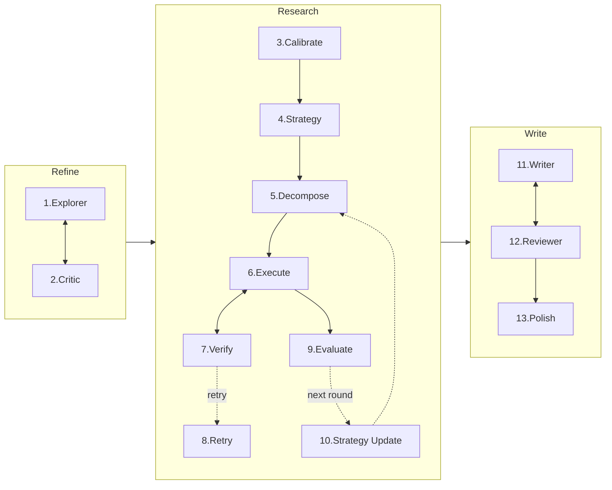

# MAARS · 13 类 LLM 调用清单

> 整条 `Refine → Research → Write` 流水线涉及 **13 类** LLM 调用。本文档只说明「谁调用 / 何时调用 / prompt 取自何处 / 输出形态」；具体 prompt 原文与 I/O 详情留给后续站点文档展开。

---

## 1. 链路总览

## 2. 统一调用入口

所有 13 类调用最终都汇聚到同一个方法：

- **`Stage._stream_llm(model, tools, instruction, user_text, ...)`** @ `backend/pipeline/stage.py:140`
  - `instruction` = system prompt
  - `user_text` = user prompt
  - 负责：速率限制、并发信号量、流式事件转发、重试（指数退避 3 次）

Research 阶段还有一层 `ResearchStage._llm(...)` 包装（`backend/pipeline/research.py:98`），用于自动带上 `task_id` 和默认 tools。

## 3. Prompt 源码组织

| 阶段 | 常量定义 | 动态分派 |
|---|---|---|
| Refine + Write | `backend/team/prompts_zh.py`、`prompts_en.py` | `backend/team/prompts.py` 按 `MAARS_OUTPUT_LANGUAGE` 导入 |
| Research | `backend/pipeline/prompts_zh.py`、`prompts_en.py` | `backend/pipeline/prompts.py` 按 `MAARS_OUTPUT_LANGUAGE` 导入 |

共享组件：

- **`_PREFIX`**：每个 system prompt 顶部通用前缀（声明「全自动、无人参与、不要提问」+ 输出语言约定）
- **`_REVIEWER_OUTPUT_FORMAT`**：被 #2 Critic 与 #12 Reviewer 复用的 JSON 输出规范（`issues[]` + `resolved[]`，由系统分配 issue ID）

## 4. 13 类调用总表

| # | 调用 | 阶段 | 频率 | System 常量 | User 构造 |
|---|---|---|---|---|---|
| 1 | Explorer | Refine | 每轮（≤10 轮）| `REFINE_EXPLORER_SYSTEM` | `TeamStage._build_primary_prompt` |
| 2 | Critic | Refine | 每轮（≤10 轮）| `REFINE_CRITIC_SYSTEM` | `TeamStage._build_reviewer_prompt` |
| 3 | Calibrate | Research | 整次研究一次 | `CALIBRATE_SYSTEM` | `ResearchStage._calibrate` 内联组装 |
| 4 | Strategy（首轮）| Research | 首轮一次 | `STRATEGY_SYSTEM` | `ResearchStage._research_strategy` 内联组装 |
| 5 | Decompose / Judge | Research | 每节点一次（递归）| `build_decompose_system(atomic_def, strategy)` | `build_decompose_user` |
| 6 | Execute | Research | 每原子任务一次 | `EXECUTE_SYSTEM` | `build_execute_prompt` |
| 7 | Verify | Research | 每次执行后 | `VERIFY_SYSTEM` | `build_verify_prompt` |
| 8 | Retry | Research | 验证失败且不再分解时 | `EXECUTE_SYSTEM`（复用 #6）| `build_retry_prompt` |
| 9 | Evaluate | Research | 每轮末 | `EVALUATE_SYSTEM` | `build_evaluate_user` |
| 10 | Strategy Update | Research | 需再迭代时 | `STRATEGY_SYSTEM`（复用 #4）| `build_strategy_update_user` |
| 11 | Writer | Write | 每轮（≤10 轮）| `WRITE_WRITER_SYSTEM` | `TeamStage._build_primary_prompt` + `WriteStage.load_input` |
| 12 | Reviewer | Write | 每轮（≤10 轮）| `WRITE_REVIEWER_SYSTEM` | `TeamStage._build_reviewer_prompt` |
| 13 | Polish | Write | 一次性（无迭代）| `POLISH_SYSTEM` | `build_polish_input` |

---

## 5. 各调用说明

### Refine 阶段

**#1 Explorer** — Refine 循环的 primary。每轮负责产出或修订 research proposal。首轮输入是用户原始 idea；后续轮输入是 idea + 上一版草稿 + Critic 留下的未解决 issues。输出完整 markdown proposal，落盘到 DB 的 `proposals/round_N.md`。调用点：`team/stage.py:99`。

**#2 Critic** — Refine 循环的 reviewer。每轮对 Explorer 产出的 proposal 做新颖性 / 可行性 / 清晰度 / 定位四维批评，并输出结构化 JSON（`issues[]` + `resolved[]`）。系统以「issues 列表为空」作为循环通过条件；Critic 本身不决定是否通过。调用点：`team/stage.py:118`。

### Research 阶段

**#3 Calibrate** — 整轮研究只调用一次。基于能力画像（沙箱约束、工具列表）+ 数据集信息 + 研究主题，产出一段「原子任务定义」（3-6 句），这段定义将被逐字注入 #5 Decompose 的 system prompt。调用点：`research.py:674`。

**#4 Strategy（首轮）** — 每轮研究的第一次调用。使用搜索工具调研领域最佳实践，输出简洁的策略文档（关键洞察 / 推荐方案 / 避坑 / 目标指标），末尾追加一行 JSON 声明分数方向（minimize/maximize）。调用点：`research.py:564`。

**#5 Decompose / Judge** — 递归分解的单元调用。对每个任务节点单独调用一次 LLM，判断是否原子；若非原子则输出 subtasks 列表。system prompt 通过 `build_decompose_system(atomic_definition, strategy)` 动态拼接 #3、#4 的产物。调用点：`decompose.py:91`。

**#6 Execute** — 每个原子任务一次。agent 在 Docker 沙箱里调用 `code_execute` 等工具，产出 markdown 结果 + 最后一行 `SUMMARY:`。输出存入 DB 的 `task_output/<id>.md`，供下游 #7、Write 阶段与 #13 Polish 使用。调用点：`research.py:497`。

**#7 Verify** — Execute 后立即调用。基于任务描述 + 执行结果输出 JSON 判定：`{pass, redecompose, review}`。`redecompose=true` 触发对该任务再一次 #5；`pass=false` 且 `redecompose=false` 触发 #8 Retry。调用点：`research.py:527`，tools=[]（不带工具）。

**#8 Retry** — Verify 判定小问题时的重试。复用 #6 的 `EXECUTE_SYSTEM`，user prompt 在原 execute user 后追加「先前输出」与「审查反馈」。一次重试后再 #7 验证，仍失败则整条流水线 FAIL。调用点：`research.py:511`。

**#9 Evaluate** — 每轮研究末一次。读取已完成任务摘要、当前/上轮分数、历史评估，输出 JSON：`{feedback, suggestions[], strategy_update?}`。`strategy_update` 缺失 = 停止迭代（默认行为）；存在则触发下一轮，并成为 #10 的输入。调用点：`research.py:629`。

**#10 Strategy Update** — 仅当 #9 返回 `strategy_update` 时调用。复用 #4 的 `STRATEGY_SYSTEM`，user prompt 由 `build_strategy_update_user` 拼接（旧策略 + 评估反馈 + 建议）。输出替换当前策略，驱动下一轮 #5 重新分解。调用点：`research.py:646`。

### Write 阶段

**#11 Writer** — Write 循环的 primary。每轮读取研究产物（`list_tasks` / `read_task_output` / `list_artifacts` / `read_artifact_file`），以 `results_summary.json` 为唯一事实锚点写出完整论文。首轮 user prompt 由 `WriteStage.load_input` 构造（含 summary JSON）；后续轮按 TeamStage 范式附加草稿 + Reviewer issues。调用点：`team/stage.py:99`（继承通道）。

**#12 Reviewer** — Write 循环的 reviewer。强制调用工具交叉核对数字（`read_artifact_file` vs. 论文中的表格值），任何不一致必须作为 Accuracy issue 上报。输出与 #2 同一套 JSON 格式。调用点：`team/stage.py:118`。

**#13 Polish** — Writer/Reviewer 循环收敛后的单次打磨，无迭代。输入是最终草稿 + 规范化实验摘要，输出打磨后的完整论文（禁止改动数据、数字、图表路径）。最终 `paper_polished.md` = Polish 输出 + 确定性元数据附录（由 `build_metadata_appendix` 拼接，非 LLM）。调用点：`team/write.py:108`。

---

## 6. 后续工作

每类调用的完整 I/O（system prompt 原文、user prompt 模板、工具集合、输出字段说明、典型案例）留给后续站点文档逐项展开。
